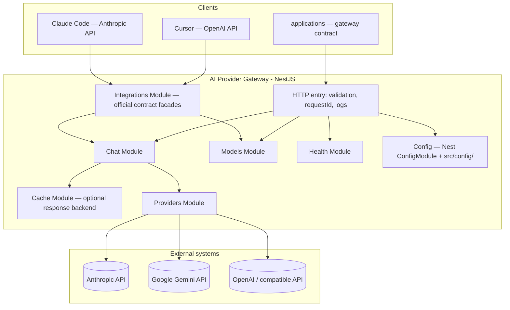
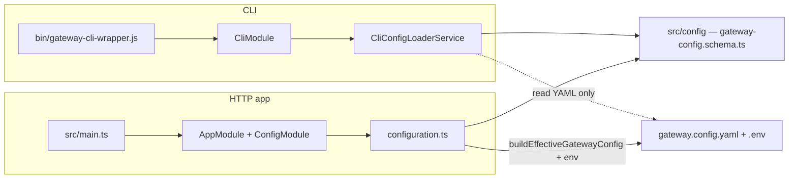

# Architecture — AI Provider Gateway

## Document purpose

Describes the **target architecture** of the “LLM Gateway” microservice: module boundaries, responsibility layers, provider integrations, and operational assumptions (configuration, security, observability).

## Logical view

## Modules (bounded areas — functional core)

| Module                                                            | Responsibility                                                                                                                                                                                                                                                                                                                                                                                                                                                                                                                                                      |
| ---------------------------------------------------------------- | --------------------------------------------------------------------------------------------------------------------------------------------------------------------------------------------------------------------------------------------------------------------------------------------------------------------------------------------------------------------------------------------------------------------------------------------------------------------------------------------------------------------------------------------------------------------- |
| **Chat** (`src/chat`)                                            | Standard chat (`POST /api/v1/chat`) and SSE streaming (`POST /api/v1/chat/stream` — `ChatStreamController`). **`ChatService`**: shared `prepareRequestForExecution` (ingress, cooldown check), `executeChat` (cache) / `executeStream` (SSE), **`ResilientExecutor`** (`src/chat/resilience/` — retry/fallback/`timeoutMs` with `AbortSignal` to adapters). **`ChatProviderCallService`**: `completeOnce` / `streamOnce` (`ProviderCallOptions.signal`), LLM metrics, SSE `meta`/`delta`. Exports **`ChatService`** and **`SmartRateLimitGuard`** for facades. Response / `done`: `toolCalls`, `finishReason`, `usageDetails`, optionally `thinkingContent`, `systemFingerprint`, `warnings`. |
| **Models** (`src/models`)                                        | Alias catalog: `GET /api/v1/models`, `GET /api/v1/models/:modelAlias`. **`GatewayModelsCatalogService`**: reads `gateway.config.yaml` (no SDK). Service exported for OpenAI/Anthropic facades (mappers `openai-models.mapper.ts`, `anthropic-models.mapper.ts`).                                                                                                                                                                                                                                                                                                     |
| **Integrations** (`src/integrations`)                            | Official contract facades: OpenAI Chat Completions (`openai/`) and Anthropic Messages (`anthropic/`) — mapping onto `ChatService` (chat) and `GatewayModelsCatalogService` (models). OpenAI: `openai-request.mapper.ts` / `openai-response.mapper.ts` (JSON), `openai-stream.mapper.ts` (SSE Chat Completions; usage when `stream_options.include_usage`), `openai-tools.mapper.ts` (function calling → `tooling`). Anthropic: `anthropic-usage.mapper.ts` (usage JSON ↔ stream), `anthropic-stream.mapper.ts` (thinking in the `done` phase). Details: `integrations.md`, `openai-contract-integration.md`, `anthropic-messages-integration.md`.                                                                                                                                                                                                                                                                |
| **Cache** (`src/cache`)                                          | Global dynamic module: backend registry (`noop` always, `redis` conditionally), `ResponseCacheService` — cache only for **`POST /api/v1/chat`**. Entry reads validated with Zod schema `CachedChatResponseSchema` (`schemas/cached-chat-response.schema.ts`); invalid shape → key deletion and cache MISS. **`RedisConnectionService`** (`adapters/redis-cache/`) is shared Redis infrastructure (cache + rate limit); activation: `isRedisRequiredFromEnv()` in `should-include-redis-stack.ts`. Env configuration: `configuration.md`.       |
| **Providers** (`src/providers`)                                  | SDK factories (`factories/`), instance bootstrap (`ProviderInstancesBootstrap`), registry by **`providerInstance`** (`ProviderRegistryService`). Types: `anthropic`, `google`, `openai`, `openai-compatible`. Mappers: `anthropic-tools.mapper.ts`, `anthropic-thinking.mapper.ts`, `google-tools.mapper.ts`, `openai/` (Chat Completions + Responses adapters; routing: `type: openai` → Responses, `openai-compatible` → Chat Completions in `create-openai-provider.core.ts`). Hides SDK and provider HTTP details.                                                  |
| **Config** (`src/config` + `ConfigModule.forRoot` in `AppModule`) | Env validation + application configuration (including paths to model/policy config files). **Facade:** `ConfigurationValidationService` (`configuration-validation.service.ts`) — entry point for env / master key / provider secrets; detailed rules in `env.validation.ts`, `provider-*-validation.ts`. Loader `configuration.ts` builds the **`AppConfiguration`** object (`app-configuration.types.ts`); runtime reads via **`getAppConfig` / `getAppConfigOrThrow`** (`typed-config.ts`). No separate Nest feature module. Fail-fast at startup. |
| **Health** (`src/health`)                                        | Liveness (`GET /api/v1/health`) and readiness (`GET /api/v1/health/ready` — `checks.config`, `checks.redis`, `checks.cache`). **`HealthService`**: `evaluateReadiness()`, `publishMetrics()`, warm-up at startup; hook in `PreMetricsScrapeRegistry` (gauges refreshed on `GET /metrics`). **`checks.redis`**: probe of shared Redis infrastructure (`RedisConnectionService.ping()`), only when `isRedisRequiredFromConfig()`; fields `required`, `consumers`. **`checks.cache`**: cache feature state; with `redis` backend availability follows from `checks.redis`. Configuration validation at **process startup**.                                                                                                              |
| **Rate limit** (`src/rate-limit`)                                | Sole gateway limit layer: smart limiting per client key (Redis via shared `RedisConnectionService`) — token bucket (RPS/burst), parallel streams (`SmartRateLimitGuard`, `SmartRateLimiterService`); cooldown after provider 429 — `prepareRequestForExecution` (check) and `ChatErrorHandlerService` (set). Limits: optionally `clients[].rateLimit` in YAML, otherwise env; switch `RATE_LIMIT_SMART_ENABLED`. No `@nestjs/throttler`.                                                                                                             |
| **Observability** (`src/observability`)                          | **`ObservabilityModule`**: `AiMetricsModule` (Sentry LLM) + **`AppMetricsModule`** (Prometheus RED, health gauges, `GET /metrics`). `PreMetricsScrapeRegistry` — hooks before metrics export.                                                                 |
| **Logging** (`src/logging`)                                      | Structured logging (Pino), optional Sentry error reporting.                                                                                                                                                                                                                                                                                                                                                                                                                                                                                                    |
| **Swagger / OpenAPI** (`src/swagger`)                            | One OpenAPI 3.1 document for **native chat**, **models**, **health**, and **official contract facades** (OpenAI + Anthropic). `@Api*` decorators on all HTTP controllers; `swagger.setup.ts` registers `extraModels` and three `securitySchemes` (`GatewayKeyAuth`, `BearerAuth`, `ApiKeyAuth`). UI: `/api/v1/api-docs`, JSON: `/api/v1/swagger.json`; export: `npm run openapi:export` → `openapi.json`.                                                                                                                                                                   |
| **CLI** (`src/cli`, `bin/`)                                      | Command-line tool for configuration and developer operations. **Separate entry point** (`bin/gateway-cli-wrapper.js` → `CommandFactory.run(CliModule)`), **without** importing `ConfigModule`. Reuses Zod schemas from `src/config/`, but loads YAML without resolving env (`CliConfigLoaderService`). Commands: `config:init` wizard, `config:validate` / `config:show`, CRUD for providers (multi-instance), models and clients, `provider:test`, `key:generate`. Details: `command_line_interface.md`, `project.structure.md` (section 2a).                                |

## CLI — isolation from HTTP runtime

CLI and the HTTP service share the repository, but **not the same bootstrap**:

Rules:

- **CLI must not require `ConfigModule`** — it creates files that the runtime needs at startup (deadlock).
- **CLI does not require a build** — the wrapper uses `ts-node` when `dist/bin/gateway-cli.js` is missing.
- **Allowed imports:** types, schemas, `validateGatewayConfig()` from `src/config/`; **forbidden:** modifying runtime logic via the CLI layer.
- **Validation:** the wizard may generate an incomplete config; full validation (identical to application startup) — at the end of `config:init` (`validateGatewayConfig()` + interactive retry loop).

Run: `npm run cli`, `npx gateway`, optionally `npm link` → bin **`gateway`** from `package.json`.

## Layers within modules (NestJS convention)

1. **Controller** — HTTP mapping, statuses, headers; no business logic and no direct provider SDK calls. Facade controllers (`src/integrations/*/controllers/`) delegate only to mappers + `ChatService`. JSON body size limit: **`1mb`** (`express.json` in `src/setup.app.ts`); global prefix **`/api/v1`** — `API_GLOBAL_PREFIX` in the same file.
2. **Service (use case)** — **`ChatService`**: orchestration (cache, rate limit, `ResilientExecutor` in `src/chat/resilience/`, response envelope). **`ChatProviderCallService`**: single provider call (`completeOnce` / `streamOnce` + optional `AbortSignal` from timeout), `resolveProviderCallOptions`, metrics.
3. **Providers (factories + registry)** — translate gateway contract ↔ provider SDK contract; one factory per **type**, many runtime instances per YAML entry; SDK-specific error handling.
4. **DTO + validation** — input and configuration validation as the system edge.

### System prompt and messages to the adapter

The HTTP contract **does not** accept the `system` role in `messages[]` (DTO validation). System content for the LLM is a **gateway policy**: at startup files from `src/config/system-prompt/` are loaded, and at runtime layers are composed (`composeSystemPrompt` in `src/chat/helpers/system-prompt.ts`):

- **MASTER** — required file `MASTER_SYSTEM_PROMPT.md`,
- **MAIN** — optional `MAIN_SYSTEM_PROMPT.md`,
- **per model** — optional `models/<modelAlias>.md` for the alias from `gateway.config.yaml`.

Section joining: double newline (`\n\n`). The result goes to the providers port as `ProviderChatInput.system`. The `messages[]` array in the request contains **`user`**, **`assistant`**, and **`tool`** (plus optional `toolCalls` on the assistant turn) and is mapped to `ProviderChatTurn[]`. Optional **`tooling`** in the body supplies tool definitions to the adapter (`buildProviderInputForAlias`).

In the provider factory layer, `system` from the port is mapped to the native SDK field:

- **Anthropic** (`@anthropic-ai/sdk`) — `messages.create({ system })`.
- **Google Gemini** (`@google/genai` 1.52+) — `config.systemInstruction` passed to `ai.models.generateContent({ config })` / stream. The factory maps the `assistant` role to `model` (Gemini SDK requirement).
- **OpenAI** (`openai` 6.x) — `type: openai` in YAML → Responses API; `type: openai-compatible` → Chat Completions (`create-openai-provider.core.ts`); `baseUrl` from env (`baseUrlRef`). Mapping details: `provider-openai-runtime.md`.

Broader prompt-layer context: `configuration.md` (section “System prompt files”).

## Configuration and secrets

- Secrets (provider keys) **only** in env (`.env` locally; in the user’s infrastructure: a secrets manager).
- At startup every **enabled** provider instance in YAML must have valid secrets (API key / base URL) — `assertEnabledProviderSecretsPresent` in the facade, called from `buildEffectiveGatewayConfig`; details: `configuration.md`.
- Configuration files describe **models, aliases, limits, and policies** (without secret values).
- The gateway starts in “plug&play” mode: if configuration is invalid → the process exits at startup with a clear message.
- **Multi-instance — multiple entries with the same `type`.** In `providers:` you may have e.g. `google` and `google-office` (both `type: google`), each with a **unique** `apiKeyRef`. Zod validation rejects duplicate `apiKeyRef`, not duplicate `type`. At startup `ProviderInstancesBootstrap` creates a separate `AIProvider` (separate SDK client) per YAML entry; `ProviderRegistryService.resolve()` selects the instance by **`models[].providerInstance`**. Details: `configuration.md` (YAML section — multi-instance example), `dictionary.md`.
- **Consistency `providers` ↔ `models`.** At startup a bidirectional configuration graph is enforced: non-empty `models`, each alias → existing `providerInstance`, each **enabled** provider → at least one alias (Zod + `buildEffectiveGatewayConfig`). Details and exceptions (`enabled: false`): `configuration.md` (section “`providers` ↔ `models` graph consistency”). First configuration: **`config:init`** wizard (`command_line_interface.md`).

Details: `configuration.md`.

## Security (overview)

- The gateway is not an “open proxy”: provider endpoints are hard-coded in SDK factories (`src/providers/factories/`).
- **Two key levels:** client (IDE / application → gateway allowlist) vs provider (`.env` → SDK). Facades use the same allowlist as `X-Gateway-Key`, but a different HTTP header (`integrations.md`).
- **Helmet** in `src/main.ts` (before `setupApp`): `x-frame-options`, `x-content-type-options`, HSTS; CSP and COEP disabled (Swagger UI). **`x-powered-by`** disabled in `setup.app.ts` (`disable('x-powered-by')`).
- JSON body size limit: **1 MB** (`express.json` in `setup.app.ts`); overflow → **413** + `VALIDATION_FAILED` (`GlobalExceptionFilter` handles `entity.too.large`).
- No secret logging: keys and sensitive headers are redacted.
- Standardized errors do not include raw SDK exception contents in production (native API: `ErrorEnvelope`; facades: vendor format).
- **Security tests** (`test/security/`, `npm run test:security`): auth bypass, Helmet headers, information disclosure, rate-limit bypass, property-based fuzzing (`fast-check`) — details: [`testing.md`](testing.md).

Details: `api-architecture.md` + `anti-patterns.md` + `integrations.md`.

## Type safety (brand types)

The `src/common/types/` layer provides **nominal TypeScript types** (`Brand<K, T>`) for values that must not be semantically swapped — e.g. `GatewayKey` vs `ProviderApiKey`, `ModelAlias` vs `ModelId`, `InputTokens` vs `OutputTokens`. Covers among others:

- **HTTP / Express:** `Express.Request.requestId: RequestId`, `gatewayKey?: GatewayKey` (`express.d.ts`).
- **Chat:** execution contexts (`ChatExecutionContext`, `ProviderCallContext`), helpers `conversation-id.ts`, `generation-warnings.ts` (`WarningCode`).
- **Config / resilience:** `AppConfiguration`, `RetryPolicy` / `ResilientExecutor` (`src/chat/resilience/`), smart rate limit, cache (`CacheKey`, `CacheTtlSeconds`).
- **Providers and facades:** `AIProvider` signatures, stream mappers, OpenAI/Anthropic/Google adapters.

**API boundary:** HTTP DTOs and OpenAPI remain on primitive types; brand types apply in internal logic. Zero runtime cost (erased at compile time). Guide: **`brand-types.md`**; term glossary: `dictionary.md` (“Brand types” section).

**Out of scope (for now):** full brand-types adoption in the CLI module (`src/cli/`) — partial; details: `brand-types.md`.

## Observability

- **Request ID**: `RequestIdMiddleware` — request header `x-request-id` (echo) or `req_<uuid>`; the same ID in body (`requestId`), error envelopes, logs, and **response header** `x-request-id`.
- **Logging**: `LoggingModule` (Pino by default); optional error reporting to Sentry (`SentryErrorReportingAdapter`).
- **AI metrics (Sentry)**: `AiMetricsService` + Sentry or noop backend — LLM spans, tokens, `conversationId` (`gen_ai.conversation.id`). Details: `conversation-tracking.md`.
- **App metrics (Prometheus)**: `AppMetricsService` — RED (requests, latency, errors, tokens), rate limit, cache, active streams, **health gauges** (`gateway_readiness`, `gateway_health_status`, `gateway_process_uptime_seconds`). Endpoint **`GET /metrics`** (outside `/api/v1`); before snapshot, hooks from `PreMetricsScrapeRegistry` are invoked — `HealthService` registers readiness refresh (5s throttle on scrape path; `/ready` without throttle). Backend: Prometheus in production or `METRICS_BACKEND=prometheus`; dev defaults to noop.
- **Alerts**: `deployment/monitoring/alerts.yml` — Prometheus rules (GatewayDown, GatewayNotReady, health components, event loop lag). Scrape: `deployment/monitoring/prometheus.yml`.
- **Graceful shutdown**: `SIGTERM` / `SIGINT` / `uncaughtException` / `unhandledRejection` in `main.ts` (`app.close()`).
- **OpenAPI**: `@Api*` decorators on controllers (`ChatController`, `ChatStreamController`, `HealthController`, OpenAI/Anthropic facade controllers) and DTOs; shared decorators in `src/common/decorators/`: `ApiGatewayChatErrorResponses`, `ApiOpenAiErrorResponses`, `ApiAnthropicErrorResponses`, `ApiRequestIdHeader`.

## Tests

- **Unit:** `src/**/*.spec.ts` — chat logic, integration mappers, cache, rate limit, guards, `ResilientExecutor`, health; mocks in `src/common/mocks/`. Run: `npm test` (counters: [`testing.md`](testing.md)).
- **HTTP E2E:** `test/e2e/` — full `AppModule` with mock overrides (`createE2eApp`); contract scenarios for native chat (including cache and stream), OpenAI/Anthropic facades (including tooling and thinking) without real API keys and Redis. Run: `npm run test:e2e`; `npm run test:all` combines runtime + E2E.
- **Integration (live):** `test/integration/` — `*.integration-spec.ts` with real provider SDKs and Redis (Docker, port **6380**); native chat/stream, cache, OpenAI/Anthropic facades, `openai` / `openai-compatible` adapter. Requires `.env.test` + `test:integration:redis:up` (`pretest:integration` hook). Run: `npm run test:integration`; setup: `test/integration/README.md`.
- **HTTP security:** `test/security/` — auth bypass, Helmet, disclosure, rate limit, fuzzing (`fast-check`); bootstrap via `create-security-app.ts` (wrapper around `createE2eApp`). Run: `npm run test:security`; in production pipeline: `npm run deploy:production`.
- Structure, helpers, and limitations details: **`testing.md`**.

## Repo structure

Orienting map of directories, files, and module responsibilities: **[`project.structure.md`](project.structure.md)**. Summary in the repo root: [`README.md`](../README.md).
