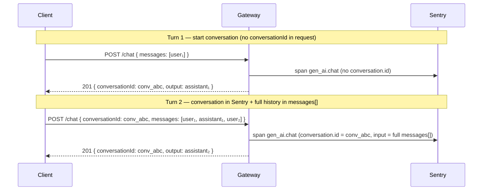

# Conversation tracking (`conversationId`)

## Purpose

The gateway supports an optional **`conversationId`** field in chat request bodies (`POST /api/v1/chat` and `POST /api/v1/chat/stream`). It is used to:

1. **Return a session ID to the client** (echo or a new `conv_<uuid>`) — the front end can store it and send it on the next turn.
2. **Group LLM metrics in Sentry** under `gen_ai.conversation.id` — **only when the client supplies `conversationId` in the request**.

The gateway is **stateless**: it does not store conversation history. Full thread content depends on the **`messages[]`** array sent by the client in every request.

Implementation: `src/chat/helpers/conversation-id.ts` (`getClientConversationId`, `getOrCreateConversationIdForResponse`), `src/chat/helpers/metrics.ts` (`buildLlmMetricsContext` — used from `ChatProviderCallService`), `src/observability/ai-metrics/adapters/sentry-ai-metrics.adapter.ts`.

---

## Two Sentry logging modes

Every provider call (except a cache hit) produces a span `op: gen_ai.chat`.

| Mode | Request condition | `gen_ai.conversation.id` | **Explore → Conversations** view |
|------|-------------------|--------------------------|-----------------------------------|
| **Single message** | No `conversationId` in body | **No** | Span in Traces; not grouped as a conversation |
| **Conversation** | `conversationId` present in body | **Yes** (value from body) | Multiple spans with the same ID = one conversation |

With `SENTRY_INCLUDE_PROMPTS=true` (see `configuration.md`) each span may have:

- `gen_ai.input.messages` — contents of **`messages[]` from the current request** (Sentry format: `role` + `parts[{ type: text, content }]`)
- `gen_ai.output.messages` — model response from **this** LLM call

`gen_ai.conversation.id` is set only by `SentryAiMetricsAdapter` when `context.conversationId` comes from the client body (`getClientConversationId`).

---

## Logging conversations from the second message (recommended flow)

Typical scenario: first turn **without** `conversationId`, subsequent turns **with** the ID returned by the gateway.



### Turn 1 (first user message)

**Request:** only `modelAlias` + `messages` (e.g. one `user` message). **No** `conversationId`.

**Sentry:**

- Span `gen_ai.chat` with this turn’s input/output (when `SENTRY_INCLUDE_PROMPTS=true`).
- **No** `gen_ai.conversation.id` — this is not an entry in **Conversations**, only a single LLM call.

**Response:** the gateway returns **`conversationId`** = `conv_<uuid>` (generated). The client **should store** this ID for turn 2.

### Turn 2 and beyond (conversation in Sentry)

**Request:**

- **`conversationId`** — the same as from turn 1 (echo or the client’s own UUID from the start).
- **`messages[]`** — the **full history** visible to the model, including:
  - the first user question (`user`),
  - the first assistant reply (`assistant`) — the **client must add it** from the turn 1 response,
  - subsequent turns.

**Sentry:**

- `gen_ai.conversation.id` = `conversationId` from the body.
- In `gen_ai.input.messages` for **this** turn you see the entire passed history (including the starting fragment from turn 1), even if turn 1 had no `conversation.id`.
- `gen_ai.output.messages` = only the response from the **current** call.

**Note on span grouping:** the turn 1 span is **not** retroactively attached to the same Conversations entity as turn 2+. In the conversation UI you will see the thread from the moment you started sending `conversationId`, with rich input on later spans. The starting content is in **`messages[]`**, not in a separate span grouped under the same ID.

### Client obligation when starting from turn 2

If you want the **full conversation content** in Sentry (including the first question–answer pair):

1. After turn 1, store `output.text` as an `assistant` message in local history.
2. From turn 2, send a **growing** `messages[]` array + **`conversationId`**.

Without the turn 1 `assistant` in `messages[]`, Sentry will only see what is in the current request (e.g. only `user₂`).

---

## API contract

### Request

```json
{
  "modelAlias": "chat-default",
  "messages": [
    { "role": "user", "content": "Hello" },
    { "role": "assistant", "content": "Hi!" },
    { "role": "user", "content": "Continue" }
  ],
  "conversationId": "conv_123e4567-e89b-12d3-a456-426614174000"
}
```

| Field | Required | Description |
|------|----------|------|
| `messages` | Yes | 1–150 elements; roles `user` \| `assistant` \| `tool` (`toolCallId` required); `content` max 10 000 (user/assistant) or 32000 (`tool`). History — **always from the client**. |
| `conversationId` | No | String in format **`conv_<uuid>`** (regex in `ChatRequestDto`). **In request:** enables Sentry grouping (`gen_ai.conversation.id`). **Absent in request:** span without conversation id; gateway returns a new `conv_<uuid>` in the response. |

Validation: `@IsOptional()`, `@IsString()`, `@Matches(/^conv_[0-9a-f]{8}-…/)`. Invalid format (e.g. `conv_abc`) → **400** (`VALIDATION_FAILED`, message: `conversationId must be conv_<uuid>`).

### Response

| Mode | Where `conversationId` appears |
|------|----------------------------|
| `POST /api/v1/chat` | JSON `ChatResponse.conversationId` |
| `POST /api/v1/chat/stream` | SSE `event: meta` |

Rules:

- Client **supplies** `conversationId` → response **echo** (same value).
- Client **does not supply** → response contains a **new** `conv_<uuid>` (to adopt on the next turn).

### Difference: field in response vs field in request (metrics)

| | In **response** | In **request** (Sentry Conversations) |
|---|----------------|--------------------------------------|
| Field absent | Returns `conv_<uuid>` | No `gen_ai.conversation.id` |
| Field present | Echo | `gen_ai.conversation.id` + turn grouping |

---

## Cache and metrics

On a **cache hit** (`POST /api/v1/chat`) the gateway does **not** call the provider and does **not** emit a new LLM span (`observeLlmCall` is skipped). The response may come from cache — with no Sentry trace for that turn.

---

## Sentry configuration

| Variable | Meaning |
|---------|-----------|
| `SENTRY_DSN` | Required for sending |
| `AI_METRICS_BACKEND=sentry` | LLM metrics adapter (`AiMetricsModule` / `ObservabilityModule`); in **production** defaults to Sentry when `AI_METRICS_BACKEND` is not set to `noop` (requires `SENTRY_DSN`) |
| `SENTRY_TRACES_SAMPLE_RATE` | e.g. `1.0` for testing |
| `SENTRY_INCLUDE_PROMPTS=true` | `gen_ai.input.messages` / `gen_ai.output.messages` on spans |
| `streamGenAiSpans: true` | In `src/instrument.ts` — **required** for the Conversations view |

Env details: `configuration.md`.

---

## Client example (turn 1 → turn 2)

```typescript
let conversationId: string | undefined;
const messages: Array<{ role: 'user' | 'assistant'; content: string }> = [];

async function sendUserTurn(userText: string) {
  messages.push({ role: 'user', content: userText });

  const res = await fetch('/api/v1/chat', {
    method: 'POST',
    headers: {
      'Content-Type': 'application/json',
      'X-Gateway-Key': process.env.GATEWAY_KEY!,
    },
    body: JSON.stringify({
      modelAlias: 'chat-default',
      messages,
      ...(conversationId ? { conversationId } : {}),
    }),
  });

  const data = await res.json();
  conversationId = data.conversationId ?? conversationId;
  messages.push({ role: 'assistant', content: data.output.text });
  return data;
}

// Turn 1: no conversationId in request → Sentry: single span
await sendUserTurn('Hello');

// Turn 2: conversationId from response + full history in messages[]
await sendUserTurn('Tell me more');
```

---

## FAQ

**Do I have to send `conversationId` in the first message?**  
No. The first turn can omit it; take `conversationId` from the response and send it from the second turn if you want Conversations in Sentry.

**Does the gateway store history?**  
No. Full history = `messages[]` in every request.

**Will the first turn land in the same Sentry conversation as the second?**  
Not as a separate span in the group — turn 1 has no `conversation.id`. Turn 1 content reaches Sentry in **`gen_ai.input.messages`** of turn 2+, if the client adds `user` + `assistant` to `messages[]`.

**Can I generate `conversationId` on the front end from turn 1?**  
Yes — then all turns from the start have `gen_ai.conversation.id` (scenario “conversation from the first message”).

**Streaming?**  
Same contract: `conversationId` in the body; in SSE `meta` the returned ID (echo or `conv_*`).

Related: [`openapi.json`](../openapi.json), `api-documentation.md`, `data-flow.md`, `pl/spec/SPEC-CHAT.md` (scenario D).
