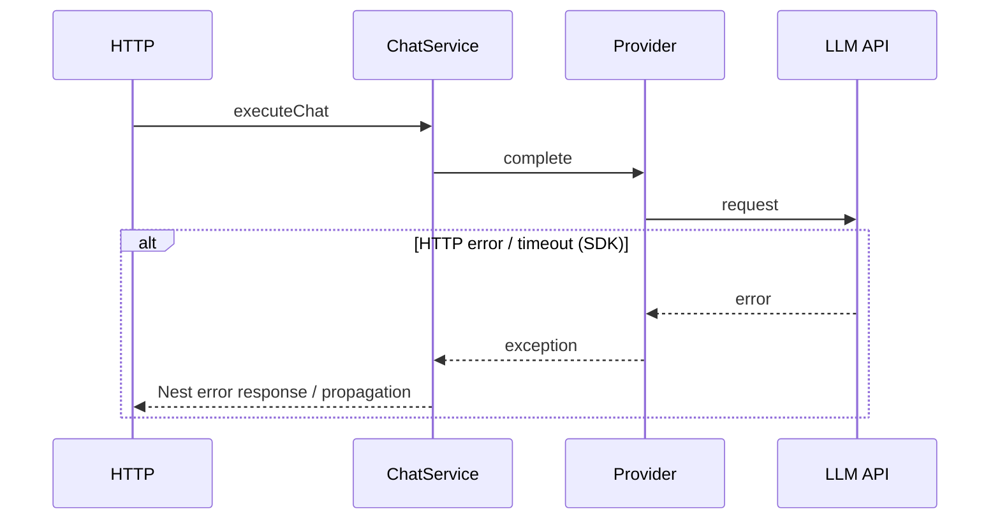
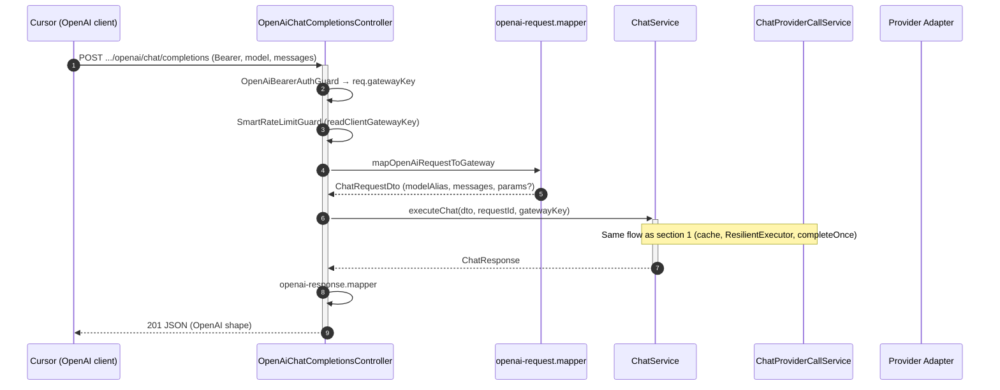
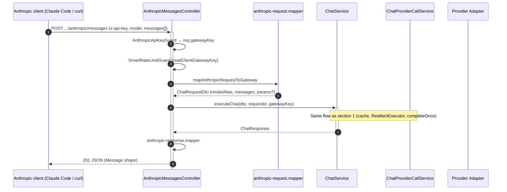

# Data flow — AI Provider Gateway

This document complements `api-documentation.md` and `architecture.md`: it shows the direction of data between the client, the HTTP layer (NestJS), application logic, and provider adapters.

**Configuration:** at startup `gateway.config.yaml` is loaded (`gateway-config.schema.ts` + `configuration.ts`). After cloning: `gateway config:init` or manual `.env` fill-in. Provider keys: **per `apiKeyRef`** in YAML for enabled instances — `configuration.md`.

## Participant legend

| Abbreviation | Meaning |
|-------|-----------|
| **Client** | Any HTTP client (application, service, BFF). |
| **HTTP** | Controller + DTO validation + response. |
| **ChatService** | Shared `prepareRequestForExecution` (ingress, tooling/thinking, **cooldown before cache**). Cache in `executeChat` (JSON) and on stream (`resolveStreamCache` → hit: `StreamCacheReplayService` / miss: `executeStreamMiss` + `setCachedIfAllowed`): alias policy → exact KV → semantic HASH (trim last-user) → embed+KNN; miss path dual-write **await** exact `SET NX` + semantic `HSETNX` (no semantic→exact promotion; **no store on `didFallback`**). In-process singleflight on identity key **JSON only** (no soft singleflight on stream; v2: Redis distributed lock — planned). `ResilientExecutor`, gateway response build (`id`, `conversationId`, `effectiveModelAlias`). |
| **ChatProviderCallService** | Single adapter call: `buildProviderInputForAlias`, `resolveProviderCallOptions`, `AiMetricsService.observeProviderCall` / `observeProviderStream`, `AppMetricsService` (RED), SSE `meta`/`delta` emission (live miss). |
| **ResilientExecutor** | `src/chat/resilience/` — retry on the requested alias (`policy.retry`, `policy.timeoutMs` → `buildRetryPolicyFromResolved`), then optionally YAML `fallback` alias (one hop). On timeout: `AbortSignal` to `completeOnce` / `streamOnce` → SDK adapter; response `PROVIDER_TIMEOUT` (504). |
| **Registry** | `ProviderRegistryService` — maps YAML alias to **`providerInstance`** → `AIProvider` + `modelId`. |
| **Provider** | `AIProvider` instance (factory + API key per YAML entry). |
| **LLM API** | External provider service. |
| **ResponseCache (ExactCache)** | `ResponseCacheService` — read/write of exact cache for **`POST /api/v1/chat`** and **`POST /api/v1/chat/stream`** plus facade streams (shared store; hash key: `modelAlias`, `clientId`, `messages`, system prompt signature, effective call parameters; **`metadata` excluded**); reads validated with `CachedChatResponseSchema`; Redis write: first-writer-wins (`SET … NX`). |
| **SemanticCache** | `SemanticCacheService` — cheap HASH on trimmed last-user (`getByTextIdentity`, no embed); on miss, embed the last `role: user` message (bare text, `qwen3-embedding:0.6b`) → KNN in Redis Search → cosine similarity threshold (default 0.85). Parallel store to exact KV (no promotion). TTL = `CACHE_TTL`. Fail-open: embedding/Search error → provider call. Skipped for tooling, `clientId === 'unknown'` (not skipped for streaming — stream uses the same layer). Store: `HSETNX` on `reply` (first-writer-wins); reuses the lookup vector or, if `embed` was not attempted, may run the first `embed` (no retry after a failed lookup). |
| **StreamCacheReplay** | `StreamCacheReplayService` — on stream cache hit: `meta` with `cached*` → `delta` chunks of 64 chars from `output.text` → `done` (delay 0). |
| **Metrics** | **`AiMetricsService`** (Sentry LLM spans) + **`AppMetricsService`** (Prometheus RED); span `gen_ai.chat` per LLM call; **`gen_ai.conversation.id`** only when client supplies `conversationId` (`conversation-tracking.md`). Health gauges refreshed on `GET /metrics`. |
| **Integration facade** | Controller `src/integrations/openai` or `anthropic` + mappers — translate vendor contract to `ChatRequestDto`, then the same `ChatService` as native chat (`integrations.md`). |

---

## 0. Shared skeleton: validation, model selection

```mermaid
sequenceDiagram
  autonumber
  participant K as Client
  participant H as HTTP (ChatController)
  participant S as ChatService
  participant E as ExactCache (ResponseCacheService)
  participant SC as SemanticCache (SemanticCacheService)

  K->>+H: POST /api/v1/chat (JSON)
  H->>H: ValidationPipe (DTO)
  Note over H: RequestIdMiddleware (req.requestId + response header x-request-id); GatewayKeyGuard + SmartRateLimitGuard on chat
  H->>+S: executeChat(request)
  S->>S: prepareRequestForExecution (cooldown before cache)
  S->>E: exact lookup (hash key)
  alt exact HIT
    E-->>S: stored response (cached: true)
    S-->>-H: 201 JSON (cached, exact)
  else exact MISS / disabled
    S->>SC: semantic lookup (HASH last-user, then embedding + KNN) — skipped for tooling / unknown clientId / multi-turn
    alt semantic HIT (HASH or similarity >= threshold, same partition)
      SC-->>S: stored response (cached: true)
      S-->>-H: 201 JSON (cached, semantic)
    else semantic MISS / disabled / fail-open
      Note over S: resolve + provider (details: section 1)
      Note over S: dual-write await exact SET + semantic upsert (no promotion)
      S-->>-H: result or HTTP exception
    end
  end
  H-->>-K: 201 JSON or error
```

On a semantic miss, `executeChat` dual-writes **before** HTTP 201: `await` exact SET **and** semantic upsert (no semantic→exact promotion; SET gets lookup embed state). Semantic-only (`CACHE_ENABLED=false`) is supported. Vector TTL = `CACHE_TTL`. Semantic store runs only for single-turn requests in the same TAG partition as lookup (`modelAlias` + `clientId` + `embeddingModel` + `systemSignature` + `callParams`).

---

## 1. Standard `POST /api/v1/chat` — success (201)

```mermaid
sequenceDiagram
  autonumber
  participant K as Client
  participant H as HTTP
  participant S as ChatService
  participant PC as ChatProviderCallService
  participant C as ResponseCache
  participant R as ProviderRegistry
  participant M as AiMetricsService
  participant P as Provider Adapter
  participant A as LLM API

  K->>+H: POST /api/v1/chat (modelAlias, messages, conversationId?, params?)
  H->>H: DTO validation
  H->>+S: executeChat
  S->>S: prepareRequestForExecution (cooldown before any cache I/O)
  S->>S: conversationId response (echo/conv_*)
  S->>+R: resolve(modelAlias)
  R-->>-S: AIProvider + policy.params
  S->>S: resolveProviderCallOptions(policy, body.params)
  S->>C: getCachedIfAllowed (alias policy → exact KV → semantic HASH → KNN)
  alt cache hit (provider enabled in YAML; entry passed CachedChatResponseSchema)
    C-->>S: JSON (with cached/cachedAt/cacheSource)
    S-->>H: response
  else no entry
    S->>S: ResilientExecutor (retry / fallback / timeout + AbortSignal)
    S->>+PC: completeOnce (per alias in chain; signal)
    PC->>PC: buildProviderInputForAlias + resolveProviderCallOptions
    PC->>+M: observeLlmCall
    M->>+P: complete(input, modelId, options)
    P->>+A: request to provider
    A-->>-P: response
    P-->>-M: ProviderChatResponse
    M-->>-PC: result + Sentry span
    PC-->>-S: response + resolved
    S->>C: await setCachedIfAllowed (exact SET + semantic upsert)
    S-->>-H: ChatResponse (id, usage, requestId, conversationId, effectiveModelAlias?, …)
  end
  H-->>-K: 201 JSON (+ conversationId)
```

**Notes:** optional **`params`** in the body are merged with `policy.params` in YAML (`resolveProviderCallOptions`) before cache and the provider call. A cached response contains **`cached: true`**, **`cachedAt`**, and **`cacheSource`** (`exact` | `semantic`); the **`requestId`** field is stamped from the **current** request (it is not stored in Redis). **`id`** (`gw_*`) comes from the stored payload. Store only when `finishReason=stop`, text is non-empty, and there are no `toolCalls` (`shouldStoreChatResponse`). A **`MODEL_NOT_ALLOWED`** error may occur right after `resolve`, before the LLM call.

---

## 2. Standard `POST /api/v1/chat` — error

Native chat JSON error responses are in the **`ErrorEnvelope`** envelope (`openapi.json`) with fields `{statusCode, code, message, requestId, details?}` — `GlobalExceptionFilter` (global). OpenAI/Anthropic facades use local filters and their own error shapes (schemas in `openapi.json`). **`code`** (native chat) comes from the exception payload or default status mapping; full dictionary: `dictionary.md`.



---

## 3. Streaming `POST /api/v1/chat/stream` — success (SSE)

Per `openapi.json` and code (`ChatStreamController`, `ChatService.resolveStreamCache` / `executeStreamMiss` / `replayStreamCacheHit`): **first** prepare + cooldown + cache lookup, **then** SSE headers. Hit: replay (`meta` with `cached*` → `delta`×64 → `done`). Miss: live `meta`/`delta`/`done` + optional write to the shared store. The `done` payload may contain: `usage` (with `totalTokens`), `toolCalls`, `finishReason`, optionally `usageDetails`, `thinkingContent`, `systemFingerprint`, `warnings`, `effectiveModelAlias`.

```mermaid
sequenceDiagram
  autonumber
  participant K as Client
  participant H as HTTP (ChatStreamController)
  participant S as ChatService
  participant C as CacheGuard / Replay
  participant PC as ChatProviderCallService
  participant R as ProviderRegistry
  participant M as AiMetricsService
  participant P as Provider Adapter
  participant A as LLM API

  K->>+H: POST /api/v1/chat/stream
  H->>H: DTO validation + validateForStreaming
  H->>+S: resolveStreamCache (prepare + cooldown + getCachedIfAllowed)
  alt cooldown
    S-->>H: RATE_LIMITED (JSON, no SSE)
    H-->>K: 429 ErrorEnvelope
  else cache hit
    S-->>-H: hit (cached, cacheSource)
    H->>H: SSE headers + flushHeaders
    H->>S: replayStreamCacheHit
    S->>C: StreamCacheReplayService (meta cached* → delta×64 → done)
    H-->>K: SSE hit
  else cache miss
    S-->>-H: miss (+ embedState?)
    H->>H: SSE headers + flushHeaders
    H->>+S: executeStreamMiss
    S->>S: ResilientExecutor (retry / fallback / timeout + AbortSignal)
    S->>+PC: streamOnce (emit via callback; signal)
    PC->>PC: buildProviderInputForAlias
    PC->>M: observeLlmStream
    PC-->>H: SSE meta (id, conversationId, effectiveModelAlias?)
    H-->>K: event meta
    PC->>+P: stream(...)
    P->>+A: streaming request
    loop fragments
      A-->>P: chunk
      P-->>PC: text
      PC-->>H: delta
      H-->>K: SSE: event delta
    end
    S-->>H: emit done (+ setCachedIfAllowed when !didFallback)
    H-->>-K: SSE: event done
  end
```

---

## 4. OpenAI facade — `POST /api/v1/openai/chat/completions`



**Streaming (`stream: true`):** controller → `resolveStreamCache` (before headers) → hit: `X-Gateway-Cache` + replay via OpenAI mapper / miss: `executeStreamMiss` → `openai-stream.mapper` (OpenAI SSE; vendor body **without** `cached*` fields). Parallel stream slot — in the facade controller, not in `StreamCleanupInterceptor` (path without `/stream` in the URL).

---

## 5. Anthropic facade — `POST /api/v1/anthropic/messages`



**Streaming (`stream: true`):** controller → `resolveStreamCache` (before headers) → hit: `X-Gateway-Cache` + replay via Anthropic mapper / miss: `executeStreamMiss` → `anthropic-stream.mapper` (Anthropic SSE; vendor body **without** `cached*` fields). Final `message_delta.usage` — via `anthropic-usage.mapper.ts` (parity with JSON). `thinking` blocks — in the `done` phase when the gateway returned `thinkingContent`. Parallel stream slot — in `AnthropicMessagesController`, analogous to OpenAI.

---

Related: [`openapi.json`](../openapi.json), `api-documentation.md`, `architecture.md`, `integrations.md`, `dictionary.md` (`RATE_LIMITED` / `PROVIDER_RATE_LIMITED` codes), `configuration.md`.
