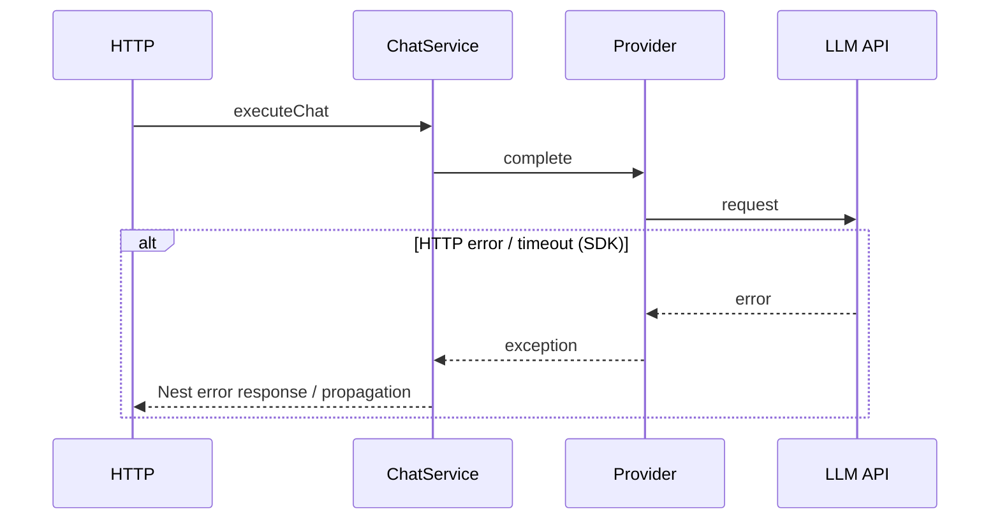
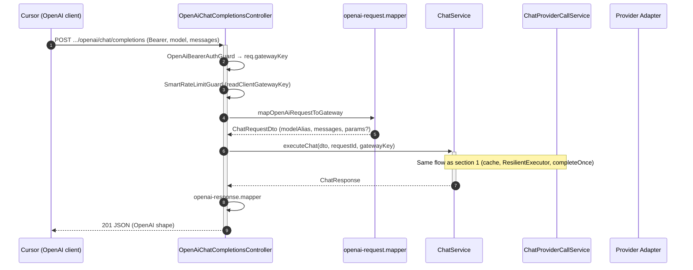
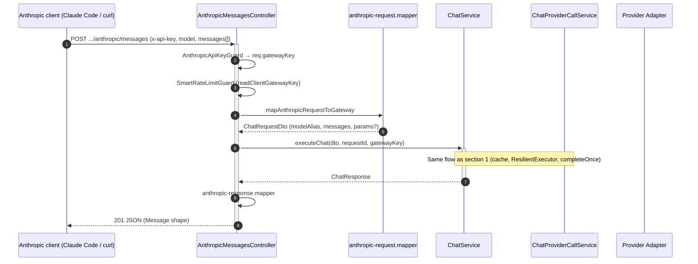

# Data flow — AI Provider Gateway

This document complements `api-documentation.md` and `architecture.md`: it shows the direction of data between the client, the HTTP layer (NestJS), application logic, and provider adapters.

**Configuration:** at startup `gateway.config.yaml` is loaded (`gateway-config.schema.ts` + `configuration.ts`). After cloning: `gateway config:init` or manual `.env` fill-in. Provider keys: **per `apiKeyRef`** in YAML for enabled instances — `configuration.md`.

## Participant legend

| Abbreviation | Meaning |
|-------|-----------|
| **Client** | Any HTTP client (application, service, BFF). |
| **HTTP** | Controller + DTO validation + response. |
| **ChatService** | Shared `prepareRequestForExecution` (ingress, tooling/thinking, cooldown check). Cache only in `executeChat`. `ResilientExecutor`, gateway response build (`id`, `conversationId`, `effectiveModelAlias`). |
| **ChatProviderCallService** | Single adapter call: `buildProviderInputForAlias`, `resolveProviderCallOptions`, `AiMetricsService.observeProviderCall` / `observeProviderStream`, `AppMetricsService` (RED), SSE `meta`/`delta` emission. |
| **ResilientExecutor** | `src/chat/resilience/` — retry on the requested alias (`policy.retry`, `policy.timeoutMs` → `buildRetryPolicyFromResolved`), then optionally YAML `fallback` alias (one hop). On timeout: `AbortSignal` to `completeOnce` / `streamOnce` → SDK adapter; response `PROVIDER_TIMEOUT` (504). |
| **Registry** | `ProviderRegistryService` — maps YAML alias to **`providerInstance`** → `AIProvider` + `modelId`. |
| **Provider** | `AIProvider` instance (factory + API key per YAML entry). |
| **LLM API** | External provider service. |
| **ResponseCache** | `ResponseCacheService` — optional read/write of **`POST /api/v1/chat`** responses (key from hash: `modelAlias`, `messages`, system prompt signature, effective call parameters); reads validated with `CachedChatResponseSchema`; no impact on streaming. |
| **Metrics** | **`AiMetricsService`** (Sentry LLM spans) + **`AppMetricsService`** (Prometheus RED); span `gen_ai.chat` per LLM call; **`gen_ai.conversation.id`** only when client supplies `conversationId` (`conversation-tracking.md`). Health gauges refreshed on `GET /metrics`. |
| **Integration facade** | Controller `src/integrations/openai` or `anthropic` + mappers — translate vendor contract to `ChatRequestDto`, then the same `ChatService` as native chat (`integrations.md`). |

---

## 0. Shared skeleton: validation, model selection

```mermaid
sequenceDiagram
  autonumber
  participant K as Client
  participant H as HTTP (ChatController)
  participant S as ChatService
  participant C as ResponseCache

  K->>+H: POST /api/v1/chat (JSON)
  H->>H: ValidationPipe (DTO)
  Note over H: RequestIdMiddleware (req.requestId + response header x-request-id); GatewayKeyGuard + SmartRateLimitGuard on chat
  H->>+S: executeChat(request)
  S->>C: get (optional)
  alt cache HIT
    C-->>S: stored response
    S-->>-H: 201 JSON (cached)
  else cache MISS / disabled
    Note over S: resolve + provider (details: section 1)
    S-->>-H: result or HTTP exception
  end
  H-->>-K: 201 JSON or error
```

---

## 1. Standard `POST /api/v1/chat` — success (201)

```mermaid
sequenceDiagram
  autonumber
  participant K as Client
  participant H as HTTP
  participant S as ChatService
  participant PC as ChatProviderCallService
  participant C as ResponseCache
  participant R as ProviderRegistry
  participant M as AiMetricsService
  participant P as Provider Adapter
  participant A as LLM API

  K->>+H: POST /api/v1/chat (modelAlias, messages, conversationId?, params?)
  H->>H: DTO validation
  H->>+S: executeChat
  S->>S: conversationId response (echo/conv_*)
  S->>+R: resolve(modelAlias)
  R-->>-S: AIProvider + policy.params
  S->>S: resolveProviderCallOptions(policy, body.params)
  S->>C: getCachedResponse (with effective params)
  alt cache hit (provider enabled in YAML; entry passed CachedChatResponseSchema)
    C-->>S: JSON (with cached/cachedAt)
    S-->>H: response
  else no entry
    S->>S: checkCooldown (optional, smart limit)
    S->>S: ResilientExecutor (retry / fallback / timeout + AbortSignal)
    S->>+PC: completeOnce (per alias in chain; signal)
    PC->>PC: buildProviderInputForAlias + resolveProviderCallOptions
    PC->>+M: observeLlmCall
    M->>+P: complete(input, modelId, options)
    P->>+A: request to provider
    A-->>-P: response
    P-->>-M: ProviderChatResponse
    M-->>-PC: result + Sentry span
    PC-->>-S: response + resolved
    S->>C: setCachedResponse
    S-->>-H: ChatResponse (id, usage, requestId, conversationId, effectiveModelAlias?, …)
  end
  H-->>-K: 201 JSON (+ conversationId)
```

**Notes:** optional **`params`** in the body are merged with `policy.params` in YAML (`resolveProviderCallOptions`) before cache and the provider call. A cached response contains **`cached: true`** and **`cachedAt`**; the **`requestId`** field comes from the request stored in cache (it is not overwritten with a new ID per request). A **`MODEL_NOT_ALLOWED`** error may occur right after `resolve`, before the LLM call.

---

## 2. Standard `POST /api/v1/chat` — error

Native chat JSON error responses are in the **`ErrorEnvelope`** envelope (`openapi.json`) with fields `{statusCode, code, message, requestId, details?}` — `GlobalExceptionFilter` (global). OpenAI/Anthropic facades use local filters and their own error shapes (schemas in `openapi.json`). **`code`** (native chat) comes from the exception payload or default status mapping; full dictionary: `dictionary.md`.



---

## 3. Streaming `POST /api/v1/chat/stream` — success (SSE)

Per `openapi.json` and code (`ChatStreamController`, `ChatService.executeStream`): SSE headers, then `meta`, `delta`, `done`. The `done` payload may contain: `usage` (with `totalTokens`), `toolCalls`, `finishReason`, optionally `usageDetails`, `thinkingContent`, `systemFingerprint`, `warnings`, `effectiveModelAlias`.

```mermaid
sequenceDiagram
  autonumber
  participant K as Client
  participant H as HTTP (ChatStreamController)
  participant S as ChatService
  participant PC as ChatProviderCallService
  participant R as ProviderRegistry
  participant M as AiMetricsService
  participant P as Provider Adapter
  participant A as LLM API

  K->>+H: POST /api/v1/chat/stream
  H->>H: DTO validation + validateForStreaming
  H->>H: SSE headers + flushHeaders
  H->>+S: executeStream
  S->>S: prepareRequestForExecution (ingress, cooldown check, …)
  S->>S: ResilientExecutor (retry / fallback / timeout + AbortSignal)
  S->>+PC: streamOnce (emit via callback; signal)
  PC->>PC: buildProviderInputForAlias
  PC->>M: observeLlmStream
  PC-->>H: SSE meta (id, conversationId, effectiveModelAlias?)
  H-->>K: event meta
  PC->>+P: stream(...)
  P->>+A: streaming request
  loop fragments
    A-->>P: chunk
    P-->>PC: text
    PC-->>H: delta
    H-->>K: SSE: event delta
  end
  S-->>H: emit done (usage?, toolCalls?, finishReason?, usageDetails?, thinkingContent?, systemFingerprint?, warnings?, effectiveModelAlias?)
  H-->>-K: SSE: event done
```

---

## 4. OpenAI facade — `POST /api/v1/openai/chat/completions`



**Streaming (`stream: true`):** controller → `executeStream` → `openai-stream.mapper` (OpenAI SSE). Parallel stream slot — in the facade controller, not in `StreamCleanupInterceptor` (path without `/stream` in the URL).

---

## 5. Anthropic facade — `POST /api/v1/anthropic/messages`



**Streaming (`stream: true`):** controller → `executeStream` → `anthropic-stream.mapper` (Anthropic SSE). Final `message_delta.usage` — via `anthropic-usage.mapper.ts` (parity with JSON). `thinking` blocks — in the `done` phase when the gateway returned `thinkingContent`. Parallel stream slot — in `AnthropicMessagesController`, analogous to OpenAI.

---

Related: [`openapi.json`](../openapi.json), `api-documentation.md`, `architecture.md`, `integrations.md`, `dictionary.md` (`RATE_LIMITED` / `PROVIDER_RATE_LIMITED` codes), `configuration.md`.
