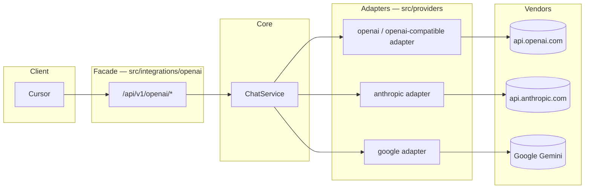
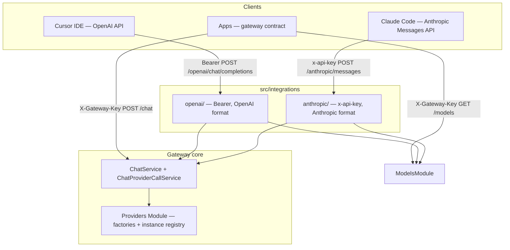

# Official contract facades — AI Provider Gateway

The **`src/integrations/`** module adds **parallel HTTP contracts** for clients that expect an official vendor API shape (OpenAI or Anthropic), without changing the gateway core (`POST /api/v1/chat`, provider layer in `src/providers/`).

## Facade ≠ provider runtime

| | **Facade** (`src/integrations/`) | **Provider runtime** (`src/providers/`) |
|---|----------------------------------|----------------------------------------|
| **Purpose** | **HTTP contract** compatibility with IDEs and other apps that expect those shapes (e.g. Cursor, Claude Code) | Calling the vendor LLM via SDK |
| **OpenAI** | `/api/v1/openai/*` — OpenAI API shape | `type: openai` / `openai-compatible` in YAML — SDK adapter (`src/providers/`) |
| **Anthropic** | `/api/v1/anthropic/*` — Anthropic Messages API shape | `type: anthropic` in YAML — SDK adapter |
| **Backend guarantee** | **None** — the facade is not bound to a vendor | Yes — `providerInstance` + `modelId` in configuration |

Facades exist because the OpenAI Chat Completions API and Anthropic Messages API have become **de facto standards** for IDEs and other clients that expect those official shapes. The gateway implements these HTTP shapes on top of a single `ChatService`; **routing requests to a provider** happens solely via **`modelAlias`** (`model` in the facade) and `gateway.config.yaml`, not by choosing the `/openai` vs `/anthropic` route.

Full term definitions: [`dictionary.md`](dictionary.md) (section “Facade vs provider runtime”).



The facade path and the adapter path are **orthogonal** — choosing `/openai` vs `/anthropic` does not select the LLM vendor.

## Philosophy

| Principle | Description |
|--------|------|
| **Three contracts, one engine** | Controllers and mappers translate HTTP; **`ChatService`** remains the sole chat orchestrator (cache, retry, fallback, limits). Model catalog — shared **`GatewayModelsCatalogService`** (`ModelsModule`) + facade mappers. |
| **Anti-corruption layer** | The `openai/` and `anthropic/` submodules are isolated — a change to the OpenAI format does not affect the Messages API. |
| **No change to the native API** | `ChatController` / `ChatStreamController` and the provider layer remain the reference point for apps written against the gateway contract. |
| **Key separation** | **Client** keys (IDE → gateway) ≠ **provider** keys (gateway → LLM in `.env`). |

## Facade scope

| Element | Description |
|---------|------|
| Directories `src/integrations/{openai,anthropic}/` | OpenAI and Anthropic facade submodules |
| `IntegrationsModule` in `AppModule` | Registers facades in the application |
| `Request.gatewayKey` in `src/common/types/express.d.ts` | Express type for the client key after auth |
| Export of `ChatService`, `SmartRateLimitGuard` from `ChatModule` | Facades import the guard from `src/guards/smart-rate-limit-guard.ts` via `@OpenAiAuth()` / `@AnthropicAuth()` |
| `readClientGatewayKey` + `SmartRateLimitGuard` / `StreamCleanupInterceptor` | Shared client key read (`src/common/readClientGatewayKey.ts`) |
| **OpenAI facade** (`OpenAiModule`) — auth, models, completions JSON + stream | [`openai-contract-integration.md`](openai-contract-integration.md); models via `GatewayModelsCatalogService` + `openai-models.mapper.ts` |
| **Anthropic facade** (`AnthropicModule`) — auth, models, messages JSON + stream | [`anthropic-messages-integration.md`](anthropic-messages-integration.md); models via `GatewayModelsCatalogService` + `anthropic-models.mapper.ts` |
| **ModelsModule** — native `GET /api/v1/models` | Shared alias catalog for the native API and facades |
| E2E tests of facade HTTP contracts (mocked runtime adapters) | `test/e2e/gateway-chat*.e2e-spec.ts`, `gateway-chat-openai.e2e-spec.ts`, `openai-facade*.e2e-spec.ts`, `anthropic-facade*.e2e-spec.ts`, `facade-models.e2e-spec.ts`, `native-models.e2e-spec.ts` — [`testing.md`](testing.md) |

Client configuration details (Cursor, Claude Code): **`openai-contract-integration.md`**, **`anthropic-messages-integration.md`**.

## Architecture view



## Three API surfaces

Application global prefix: **`/api/v1`** (`API_GLOBAL_PREFIX` in `src/setup.app.ts`).

| Surface | Base URL (example) | Client auth | Main routes |
|--------------|---------------------|--------------|--------------|
| **Native** | `http://host:3000/api/v1` | `X-Gateway-Key` | `GET /models`, `POST /chat`, `POST /chat/stream` |
| **OpenAI** | `http://host:3000/api/v1/openai` | `Authorization: Bearer <client_key>` | `GET /models`, `POST /chat/completions` |
| **Anthropic** | `http://host:3000/api/v1/anthropic` | `x-api-key` (or Bearer) | `GET /models`, `POST /messages` |

The IDE sets a **Base URL** with the integration segment; the client appends paths from the vendor spec (`/models`, `/chat/completions`, `/messages`) — the same pattern as `https://api.openai.com/v1` + `/chat/completions`.

**Native model catalog:** `GET /api/v1/models` — the gateway’s own contract (`GatewayModelDto`), not the OpenAI or Anthropic shape. Facades still expose `/openai/models` and `/anthropic/models` in vendor format; all three surfaces read the same YAML via **`GatewayModelsCatalogService`**.

Path constants in `src/integrations/integrations.constants.ts`:

- `OPENAI_INTEGRATION_PATH = 'openai'`
- `ANTHROPIC_INTEGRATION_PATH = 'anthropic'`

## Model mapping

The **`model`** field in a facade request (OpenAI / Anthropic) = **`modelAlias`** from `gateway.config.yaml` (e.g. `chat-default`, `claude-sonnet`). The vendor `modelId` stays in configuration; the client does not supply it directly.

`GET .../models` (facade or native `/models`) returns aliases from `gateway.config.yaml`, in the format of the corresponding surface (gateway DTO vs OpenAI list vs Anthropic list).

## Authorization — two levels

### Client keys (frontend / IDE → gateway)

All three surfaces verify **the same allowlist** (`gatewayKey.allowList` from `.env` / `gateway.config.yaml`):

| Surface | Header | Guard |
|--------------|----------|-------|
| Native | `X-Gateway-Key` | `GatewayKeyGuard` |
| OpenAI | `Authorization: Bearer` | `OpenAiBearerAuthGuard` → `req.gatewayKey` |
| Anthropic | `x-api-key` (priority) or Bearer | `AnthropicApiKeyGuard` → `req.gatewayKey` |

Internal error codes (`GATEWAY_KEY_MISSING`, `GATEWAY_KEY_INVALID`) are mapped to the OpenAI format (`error.type`) or Anthropic format in **local filters** (`OpenAiExceptionFilter`, `AnthropicExceptionFilter`). `GlobalExceptionFilter` still handles the native API.

### Provider keys (gateway → LLM)

Adapters in `src/providers/` use keys from env referenced by **`apiKeyRef`** in YAML (e.g. `ANTHROPIC_PRIMARY_API_KEY`, `GOOGLE_API_KEY`) — **never** the client key from the IDE.

## Smart rate limit

Facades must share **`SmartRateLimiterService`** with the native API.

**Guard order (required):**

1. Facade auth guard (sets `req.gatewayKey`)
2. `SmartRateLimitGuard` (token bucket RPS, concurrent streams)

**Cooldown** after a 429 from the provider: **`prepareRequestForExecution`** (shared by `executeChat` and `resolveStreamCache` / stream miss) → `checkCooldown`; **setting** the cooldown — `ChatErrorHandlerService.handleProviderError` → `setCooldown` (both paths). **Response cache** — JSON (`executeChat`) and stream (`resolveStreamCache` / `executeStreamMiss`); facades: `X-Gateway-Cache` header on JSON and stream hit.

**Helper `readClientGatewayKey(req)`** (`src/common/readClientGatewayKey.ts`):

- integrations: `req.gatewayKey` after the facade guard,
- native API: `X-Gateway-Key` (`readGatewayKeyHeader`).

**Concurrent streams:** native `POST /chat/stream` — `SmartRateLimitGuard` (URL ends with `/stream`) + `StreamCleanupInterceptor`. OpenAI / Anthropic facades (`stream: true` in body) — **slot reservation and release in the facade controller** (the guard does not parse the `stream` body).

## Request flow (implementation)

1. HTTP → facade controller + vendor DTO validation.
2. Request mapper → `ChatRequestDto` (`modelAlias`, `messages`, optionally `params`, `metadata`, `tooling` — tools/tool_calls from the vendor contract).
3. `ChatService.executeChat` / `executeStream` with ingress profile (`facade-openai` / `facade-anthropic`), `validateChatIngress`, `req.gatewayKey` and `req.requestId`.
4. Response / stream mapper → OpenAI or Anthropic format (Anthropic: `finishReason` → `stop_reason` via `anthropic-stop-reason.mapper.ts`).
5. Gateway-specific fields (`provider`, `cached`, `conversationId`) are **not** exposed in MVP facades.

## Ingress validation limits (`validateChatIngress`)

The gateway applies **different validation profiles** for the native API and official contract facades:

| Profile | Endpoint | Max messages | Max content (user/assistant) | Max content (tool) |
|--------|----------|--------------|------------------------------|---------------------|
| `native` | `/api/v1/chat`, `/api/v1/chat/stream` | 150 | 10000 | 32000 |
| `facade-openai` | `/api/v1/openai/chat/completions` | 15000 | 128000 | 128000 |
| `facade-anthropic` | `/api/v1/anthropic/messages` | 15000 | 128000 | 128000 |

**Implementation:** `validateChatIngress()` in `src/chat/validation/chat-ingress.validator.ts` — called in `ChatService.executeChat` / `executeStream` before orchestration (profiles: `ChatIngressProfile` in `chat-ingress.types.ts`; limits: `INGRESS_LIMITS` in `chat-ingress.constants.ts`).  
**Tests:** `src/chat/validation/chat-ingress.validator.spec.ts`, E2E in `test/e2e/` (including `gateway-chat.e2e-spec.ts`, `openai-facade.e2e-spec.ts`).

## Streaming

| API | Stream format |
|-----|-------------------|
| Native | Gateway SSE: `meta` → `delta` → `done` (`done`: `usage`, `toolCalls`, `finishReason`, optionally `usageDetails`, `thinkingContent`, `systemFingerprint`, `warnings`, `effectiveModelAlias`) |
| OpenAI | SSE compatible with OpenAI Chat Completions (`data: {...}`); usage in the final chunk only when `stream_options.include_usage` or `include_usage` |
| Anthropic | SSE compatible with Anthropic Messages (`message_start`, `content_block_*`, `message_delta`, `message_stop`); final `message_delta.usage` with `input_tokens`, `output_tokens` and cache fields; `thinking` blocks in the `done` phase when upstream returned `thinkingContent` |

Internally, facades use `ChatProviderCallService.streamOnce` and map gateway events to the vendor format (`openai-stream.mapper.ts`, `anthropic-stream.mapper.ts`; Anthropic usage — shared `anthropic-usage.mapper.ts` with JSON).

## Errors and filters

- **Native API:** `GlobalExceptionFilter` → `ErrorEnvelope`.
- **Facades:** local filters on controllers (`@OpenAiAuth()`, `@AnthropicAuth()`) — JSON shape like the vendor, while preserving the **`x-request-id`** header.

## Facade limitations

| Topic | Decision |
|-------|---------|
| `system` in client messages | **Ignored** — prompt from `src/config/system-prompt/` (source: server, not client body) |
| Tools / function calling | Mapped to internal `tooling` (`openai-tools.mapper.ts`, `anthropic-tools.mapper.ts`); requires `capabilities.tools: true` on the alias |
| Multimodal (images) | Unsupported — 400 for `image` blocks (Anthropic) |
| Response cache | Works via `ChatService` for JSON and stream; `cached*` fields hidden in facade body — signal: `X-Gateway-Cache` |
| `system_fingerprint` / `systemFingerprint` | OpenAI facade: pass-through when upstream returns it (practically OpenAI). Anthropic facade: no field. Anthropic/Gemini have no upstream equivalent — see `dictionary.md` |
| OpenAPI / Swagger | Tags **OpenAI API** and **Anthropic API** in `openapi.json` and Swagger UI; separate error schemas (`OpenAiErrorResponseDto`, `AnthropicErrorResponseDto`) |

## File structure

```
src/integrations/
├── integrations.module.ts
├── integrations.constants.ts
├── openai/
│   ├── controllers/     # models, chat/completions
│   ├── mappers/         # request, response, stream, tools, messages, openai-models
│   ├── helpers/         # normalize-openai-content, openai-stream-api-description
│   ├── guards/          # Bearer auth
│   ├── filters/         # OpenAI-shaped errors
│   ├── decorators/      # @OpenAiAuth()
│   └── dtos/            # including openai-error-response.dto.ts
└── anthropic/
    ├── controllers/     # models, messages
    ├── mappers/         # request, response, stream, tools, anthropic-stop-reason, anthropic-usage, anthropic-models
    ├── helpers/         # anthropic-stream-api-description
    ├── guards/          # x-api-key auth
    ├── filters/
    ├── decorators/      # @AnthropicAuth()
    └── dtos/            # including anthropic-error-response.dto.ts
```

Alias catalog: **`src/models/`** (`ModelsModule`, `GatewayModelsCatalogService`) — imported by `OpenAiModule` and `AnthropicModule`. Facade controllers call `catalog.list()` / `getOne()` and map the result via `openai-models.mapper.ts` / `anthropic-models.mapper.ts`.

## Related documents

- `openai-contract-integration.md` — OpenAI facade, Cursor IDE configuration
- `provider-openai-runtime.md` — OpenAI runtime adapter (`src/providers/`)
- `anthropic-messages-integration.md` — Anthropic facade, Claude Code configuration
- `endpoints.md` — full route list (including facades)
- `data-flow.md` — flow diagrams
- `architecture.md`, `project.structure.md`
- `dictionary.md` — concepts (facade, client key)
- `anti-patterns.md` — pitfalls with multiple contracts
- `testing.md` — E2E tests for facades and native chat
