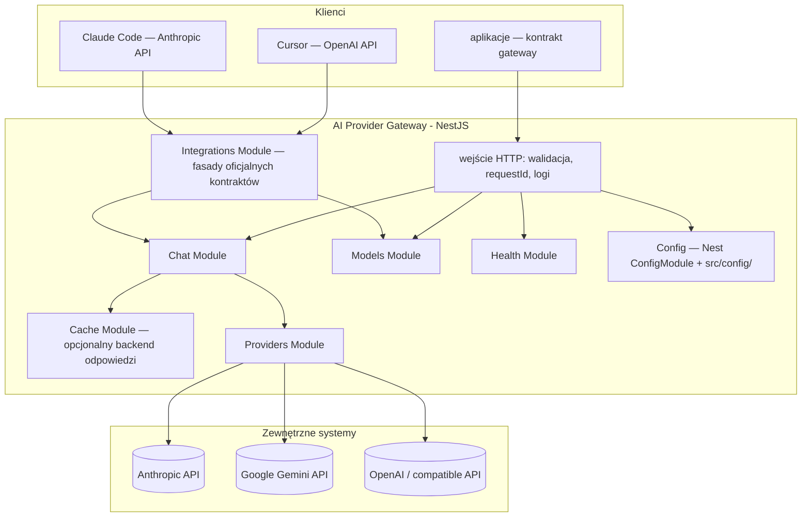
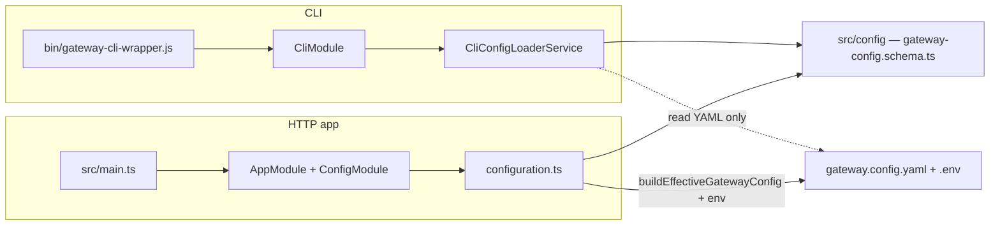

# Architektura — AI Provider Gateway

## Cel dokumentu

Opisuje **docelową architekturę** aplikacji “LLM Gateway”: granice modułów, warstwy odpowiedzialności, integracje z providerami oraz założenia operacyjne (konfiguracja, bezpieczeństwo, observability).

## Widok logiczny

## Moduły (bounded areas — rdzeń funkcjonalny)

| Moduł                                                            | Odpowiedzialność                                                                                                                                                                                                                                                                                                                                                                                                                                                                                                                                                      |
| ---------------------------------------------------------------- | --------------------------------------------------------------------------------------------------------------------------------------------------------------------------------------------------------------------------------------------------------------------------------------------------------------------------------------------------------------------------------------------------------------------------------------------------------------------------------------------------------------------------------------------------------------------- |
| **Chat** (`src/chat`)                                            | Czat standardowy (`POST /api/v1/chat`) i streaming SSE (`POST /api/v1/chat/stream` — `ChatStreamController`). **`ChatService`**: wspólne `prepareRequestForExecution` (ingress, cooldown check), `executeChat` (cache) / `resolveStreamCache` + `executeStreamMiss` / `replayStreamCacheHit` (`StreamCacheReplayService`), **`ResilientExecutor`** (`src/chat/resilience/` — retry/fallback/`timeoutMs` z `AbortSignal` do adapterów). **`ChatProviderCallService`**: `completeOnce` / `streamOnce` (`ProviderCallOptions.signal`), metryki LLM, SSE `meta`/`delta`. Eksport **`ChatService`** i **`SmartRateLimitGuard`** dla fasad. Odpowiedź / `done`: `toolCalls`, `finishReason`, `usageDetails`, opcjonalnie `thinkingContent`, `systemFingerprint`, `warnings`. |
| **Models** (`src/models`)                                        | Katalog aliasów: `GET /api/v1/models`, `GET /api/v1/models/:modelAlias`. **`GatewayModelsCatalogService`**: odczyt `gateway.config.yaml` (bez SDK). Eksport serwisu dla fasad OpenAI/Anthropic (mappery `openai-models.mapper.ts`, `anthropic-models.mapper.ts`).                                                                                                                                                                                                                                                                                                     |
| **Integrations** (`src/integrations`)                            | Fasady oficjalnych kontraktów: OpenAI Chat Completions (`openai/`) i Anthropic Messages (`anthropic/`) — mapowanie na `ChatService` (czat) i `GatewayModelsCatalogService` (models). OpenAI: `openai-request.mapper.ts` / `openai-response.mapper.ts` (JSON), `openai-stream.mapper.ts` (SSE Chat Completions; usage przy `stream_options.include_usage`), `openai-tools.mapper.ts` (function calling → `tooling`). Anthropic: `anthropic-usage.mapper.ts` (usage JSON ↔ stream), `anthropic-stream.mapper.ts` (thinking w fazie `done`). Szczegóły: `integracje.md`, `integracja_openai_kontrakt.md`, `integracja_anthropic_messages.md`.                                                                                                                                                                                                                                                                |
| **Cache** (`src/cache`)                                          | Globalny moduł dynamiczny z **dwiema warstwami cache** dla `POST /api/v1/chat` **i** streamu (wspólny magazyn): (1) **Cache exact** — rejestr backendów (`noop` zawsze, `redis` warunkowo, zapis `SET NX`), `ResponseCacheService`, klucz z hasha `(modelAlias, clientId, messages, system prompt, efektywne parametry)`; odczyt wpisów walidowany `CachedChatResponseSchema`. (2) **Cache semantyczny** (`src/cache/semantic/`) — port `EmbeddingBackend` (adapter Ollama) + port `VectorStore` (adapter Redis Search KNN, upsert `HSETNX`); `SemanticCacheService` najpierw szuka HASH tożsamości przyciętego last-user (`getByTextIdentity`); przy missie embeddinguje ostatnią wiadomość `role: user` żądania **jednoturowego**, odpytuje indeks nearest-neighbour z filtrem TAG `modelAlias` + `clientId` + `embeddingModel` + `systemSignature` + `callParams`, stosuje próg podobieństwa. Pipeline: cooldown → polityka aliasu → exact KV → semantic HASH (trim last-user) → embed+KNN → provider → dual-write sync (await exact SET NX + semantic upsert; bez promocji; bez zapisu przy `didFallback`). Semantic-only (`CACHE_ENABLED=false`) wspierany. Domyślny próg 0.85. TTL wektorów = `CACHE_TTL`. Wielotura → skip semantic; fail-open gdy embedding/Search niedostępny; co najwyżej jeden `embed` na żądanie (reuse wektora z lookupu przy zapisie; brak retry gdy `embed` już był). **`RedisConnectionService`** (`adapters/redis-cache/`) to współdzielona infrastruktura Redis (cache exact + rate limit + semantic cache Search); aktywacja: `isRedisRequiredFromEnv()` w `should-include-redis-stack.ts` — Redis jest wymagany gdy exact cache używa `redis`, smart rate limit jest włączony **albo** `SEMANTIC_CACHE_ENABLED=true` (Search). Gdy `SEMANTIC_CACHE_ENABLED=true`, w `GET /api/v1/health/ready` pojawia się `checks.embeddings` (fail-open, nie blokuje `ready`). Domyślny model embeddingu: `qwen3-embedding:0.6b` (DIM 1024). Bramka zapisu: `shouldStoreChatResponse` (`finishReason=stop`, niepusty tekst, bez `toolCalls`); `requestId` nie jest zapisywany — hit stempluje bieżące żądanie; `id` z payloadu. Env: `konfiguracja.md`. |
| **Providers** (`src/providers`)                                  | Fabryki SDK (`factories/`), bootstrap instancji (`ProviderInstancesBootstrap`), rejestr po **`providerInstance`** (`ProviderRegistryService`). Typy: `anthropic`, `google`, `openai`, `openai-compatible`. Mapery: `anthropic-tools.mapper.ts`, `anthropic-thinking.mapper.ts`, `google-tools.mapper.ts`, `openai/` (adapters Chat Completions + Responses; routing: `type: openai` → Responses, `openai-compatible` → Chat Completions w `create-openai-provider.core.ts`). Ukrywa SDK i szczegóły HTTP providerów.                                                  |
| **Config** (`src/config` + `ConfigModule.forRoot` w `AppModule`) | Walidacja env + konfiguracja aplikacji (w tym ścieżki do plików konfiguracyjnych modeli/polityk). **Fasada:** `ConfigurationValidationService` (`configuration-validation.service.ts`) — punkt wejścia dla env / master key / sekretów providerów; reguły szczegółowe w `env.validation.ts`, `provider-*-validation.ts`. Loader `configuration.ts` składa obiekt **`AppConfiguration`** (`app-configuration.types.ts`); odczyt w runtime przez **`getAppConfig` / `getAppConfigOrThrow`** (`typed-config.ts`). Brak osobnego Nest feature module. Fail‑fast przy starcie. |
| **Health** (`src/health`)                                        | Liveness (`GET /api/v1/health`) i readiness (`GET /api/v1/health/ready` — `checks.config`, `checks.redis`, `checks.cache`, opcjonalnie `checks.embeddings` / `checks.vectorStore`). **`HealthService`**: `evaluateReadiness()`, `publishMetrics()`, warm-up przy starcie; hook w `PreMetricsScrapeRegistry` (gauge'e odświeżane przy `GET /metrics`). **`checks.redis`**: probe współdzielonej infrastruktury Redis (`RedisConnectionService.ping()`), tylko gdy `isRedisRequiredFromConfig()`; pola `required`, `consumers` (dozwolone: `cache`, `rate-limit`, `semantic-cache`). **`checks.cache`**: agregat **włączonych** warstw pipeline (exact Redis KV i/lub semantic embeddings + vectorStore); `healthy` tylko gdy wszystkie włączone warstwy działają, inaczej `degraded` (`exact-redis`, `embeddings`, `vectorStore`). Obie wyłączone → `Cache disabled (noop)`. `degraded` nie blokuje `ready`. **`checks.embeddings`**: probe serwisu embeddingów, obecne tylko gdy `SEMANTIC_CACHE_ENABLED=true`; fail-open (nie resetuje obwodu embeddingu). **`checks.vectorStore`**: probe Redis Search / indeksu (`FT.INFO`), obecne tylko gdy semantic włączony; fail-open. Walidacja konfiguracji przy **starcie** procesu.                           |
| **Rate limit** (`src/rate-limit`)                                | Jedyna warstwa limitów gateway: smart limiting per klucz klienta (Redis przez wspólny `RedisConnectionService`) — token bucket (RPS/burst), równoległe streamy (`SmartRateLimitGuard`, `SmartRateLimiterService`); cooldown po 429 od providera — `prepareRequestForExecution` (check) i `ChatErrorHandlerService` (set). Limity: opcjonalnie `clients[].rateLimit` w YAML, inaczej env; przełącznik `RATE_LIMIT_SMART_ENABLED`. Bez `@nestjs/throttler`.                                                                                                             |
| **Observability** (`src/observability`)                          | **`ObservabilityModule`**: `AiMetricsModule` (Sentry LLM) + **`AppMetricsModule`** (Prometheus RED, health gauges, `GET /metrics`). `PreMetricsScrapeRegistry` — hooki przed exportem metryk.                                                                 |
| **Logging** (`src/logging`)                                      | Structured logging (Pino), opcjonalnie Sentry error reporting.                                                                                                                                                                                                                                                                                                                                                                                                                                                                                                    |
| **Swagger / OpenAPI** (`src/swagger`)                            | Jeden dokument OpenAPI 3.1 dla **natywnego czatu**, **models**, **health** i **fasad oficjalnych kontraktów** (OpenAI + Anthropic). Dekoratory `@Api*` na wszystkich kontrolerach HTTP; `swagger.setup.ts` rejestruje `extraModels` i trzy `securitySchemes` (`GatewayKeyAuth`, `BearerAuth`, `ApiKeyAuth`). UI: `/api/v1/api-docs`, JSON: `/api/v1/swagger.json`; eksport: `npm run openapi:export` → `openapi.json`.                                                                                                                                                                   |
| **CLI** (`src/cli`, `bin/`)                                      | Narzędzie wiersza poleceń dla konfiguracji i operacji developerskich. **Osobny entry point** (`bin/gateway-cli-wrapper.js` → `CommandFactory.run(CliModule)`), **bez** importu `ConfigModule`. Reużywa schematy Zod z `src/config/`, ale ładuje YAML bez rozwiązywania env (`CliConfigLoaderService`). Komendy: wizard `config:init`, `config:validate` / `config:show`, CRUD providerów (multi-instance), modeli i klientów, `provider:test`, `key:generate`. Szczegóły: `CLI.md`, `architektura_katalogi_pliki.md` (sekcja 2a).                                |

## CLI — izolacja od runtime HTTP

CLI i serwis HTTP współdzielą repozytorium, ale **nie ten sam bootstrap**:

Zasady:

- **CLI nie może wymagać `ConfigModule`** — tworzy pliki, których runtime potrzebuje przy starcie (deadlock).
- **CLI nie wymaga build** — wrapper używa `ts-node`, gdy brak `dist/bin/gateway-cli.js`.
- **Dozwolone importy:** typy, schematy, `validateGatewayConfig()` z `src/config/`; **zabronione:** modyfikacja logiki runtime przez warstwę CLI.
- **Walidacja:** wizard może generować niedokończony config; pełna walidacja (identyczna jak przy starcie aplikacji) — na końcu `config:init` (`validateGatewayConfig()` + interaktywna pętla retry).

Uruchomienie: `npm run cli`, `npx gateway`, opcjonalnie `npm link` → bin **`gateway`** z `package.json`.

## Warstwy wewnątrz modułów (konwencja NestJS)

1. **Controller** — mapowanie HTTP, statusy, nagłówki; brak logiki biznesowej i brak bezpośrednich wywołań SDK providerów. Kontrolery fasad (`src/integrations/*/controllers/`) delegują wyłącznie do mapperów + `ChatService`. Limit rozmiaru body JSON: **`1mb`** (`express.json` w `src/setup.app.ts`); globalny prefiks **`/api/v1`** — `API_GLOBAL_PREFIX` w tym samym pliku.
2. **Service (use case)** — **`ChatService`**: orkiestracja (cache, rate limit, `ResilientExecutor` w `src/chat/resilience/`, envelope odpowiedzi). **`ChatProviderCallService`**: pojedyncze wywołanie providera (`completeOnce` / `streamOnce` + opcjonalny `AbortSignal` z timeoutu), `resolveProviderCallOptions`, metryki.
3. **Providers (fabryki + rejestr)** — tłumaczenie kontraktu gateway ↔ kontrakt SDK providera; jedna fabryka per **typ**, wiele instancji runtime per wpis YAML; obsługa błędów specyficznych dla SDK.
4. **DTO + walidacja** — walidacja wejścia i konfiguracji jako brzeg systemu.

### System prompt i wiadomości do adaptera

Kontrakt HTTP **nie** przyjmuje roli `system` w `messages[]` (walidacja DTO). Treść systemowa dla LLM jest **polityką gatewaya**: przy starcie wczytywane są pliki z `src/config/system-prompt/`, a w runtime składane są warstwy (`composeSystemPrompt` w `src/chat/helpers/system-prompt.ts`):

- **MASTER** — wymagany plik `MASTER_SYSTEM_PROMPT.md`,
- **MAIN** — opcjonalny `MAIN_SYSTEM_PROMPT.md`,
- **per model** — opcjonalny `models/<modelAlias>.md` dla aliasu z `gateway.config.yaml`.

Łączenie sekcji: podwójna nowa linia (`\n\n`). Wynik trafia do portu providerów jako `ProviderChatInput.system`. Tablica `messages[]` w żądaniu zawiera **`user`**, **`assistant`** i **`tool`** (oraz opcjonalne `toolCalls` na turze asystenta) i jest mapowana na `ProviderChatTurn[]`. Opcjonalne **`tooling`** w body dostarcza definicje narzędzi do adaptera (`buildProviderInputForAlias`).

W warstwie fabryki providera `system` z portu jest mapowany na natywne pole SDK:

- **Anthropic** (`@anthropic-ai/sdk`) — `messages.create({ system })`.
- **Google Gemini** (`@google/genai` 1.52+) — `config.systemInstruction` przekazywane do `ai.models.generateContent({ config })` / stream. Fabryka mapuje rolę `assistant` na `model` (wymóg SDK Gemini).
- **OpenAI** (`openai` 6.x) — `type: openai` w YAML → Responses API; `type: openai-compatible` → Chat Completions (`create-openai-provider.core.ts`); `baseUrl` z env (`baseUrlRef`). Szczegóły mapowania: `provider_openai_runtime.md`.

Szerszy kontekst warstw promptu: `konfiguracja.md` (sekcja „Pliki system promptu”).

## Konfiguracja i sekrety

- Sekrety (klucze providerów) **wyłącznie** w env (`.env` lokalnie, w infrastrukturze użytkownika: menedżer sekretów).
- Przy starcie każda **włączona** instancja providera w YAML musi mieć poprawne sekrety (API key / base URL) — `assertEnabledProviderSecretsPresent` w fasadzie, wołane z `buildEffectiveGatewayConfig`; szczegóły: `konfiguracja.md`.
- Pliki konfiguracyjne opisują **modele, aliasy, limity i polityki** (bez wartości sekretów).
- Gateway uruchamia się w trybie “plug&play”: jeśli konfiguracja jest błędna → proces kończy się na starcie z czytelną informacją.
- **Multi-instance — wiele wpisów z tym samym `type`.** W `providers:` może być np. `google` i `google-office` (oba `type: google`), każdy z **unikalnym** `apiKeyRef`. Walidacja Zod odrzuca duplikat `apiKeyRef`, nie duplikat `type`. Przy starcie `ProviderInstancesBootstrap` tworzy osobny `AIProvider` (osobny klient SDK) per wpis YAML; `ProviderRegistryService.resolve()` wybiera instancję po **`models[].providerInstance`**. Szczegóły: `konfiguracja.md` (sekcja YAML — przykład multi-instance), `dictionary.md`.
- **Spójność `providers` ↔ `models`.** Przy starcie wymuszany jest dwukierunkowy graf konfiguracji: niepuste `models`, każdy alias → istniejący `providerInstance`, każdy **włączony** provider → co najmniej jeden alias (Zod + `buildEffectiveGatewayConfig`). Szczegóły i wyjątki (`enabled: false`): `konfiguracja.md` (sekcja „Spójność grafu `providers` ↔ `models`”). Pierwsza konfiguracja: wizard **`config:init`** (`CLI.md`).

Szczegóły: `konfiguracja.md`.

## Bezpieczeństwo (przegląd)

- Gateway nie jest “open proxy”: endpointy providerów są zaszyte w fabrykach SDK (`src/providers/factories/`).
- **Dwa poziomy kluczy:** klient (IDE / aplikacja → allowlista gateway) vs provider (`.env` → SDK). Fasady używają tej samej allowlisty co `X-Gateway-Key`, ale innego nagłówka HTTP (`integracje.md`).
- **Helmet** w `src/main.ts` (przed `setupApp`): `x-frame-options`, `x-content-type-options`, HSTS; CSP i COEP wyłączone (Swagger UI). **`x-powered-by`** wyłączone w `setup.app.ts` (`disable('x-powered-by')`).
- Limit rozmiaru body JSON: **1 MB** (`express.json` w `setup.app.ts`); przekroczenie → **413** + `VALIDATION_FAILED` (`GlobalExceptionFilter` obsługuje `entity.too.large`).
- Brak logowania sekretów: klucze i wrażliwe nagłówki są redagowane.
- Ustandaryzowane błędy nie zawierają surowych treści wyjątków SDK na produkcji (natywne API: `ErrorEnvelope`; fasady: format vendora).
- **Testy security** (`test/security/`, `npm run test:security`): auth bypass, nagłówki Helmet, information disclosure, rate-limit bypass, fuzzing property-based (`fast-check`) — szczegóły: [`testy.md`](testy.md).

Szczegóły: `architektura_api.md` + `anty_patterny.md` + `integracje.md`.

## Type safety (brand types)

Warstwa `src/common/types/` dostarcza **nominalne typy TypeScript** (`Brand<K, T>`) dla wartości, których nie wolno semantycznie zamieniać — np. `GatewayKey` vs `ProviderApiKey`, `ModelAlias` vs `ModelId`, `InputTokens` vs `OutputTokens`. Obejmuje m.in.:

- **HTTP / Express:** `Express.Request.requestId: RequestId`, `gatewayKey?: GatewayKey` (`express.d.ts`).
- **Czat:** konteksty wykonania (`ChatExecutionContext`, `ProviderCallContext`), helpery `conversation-id.ts`, `generation-warnings.ts` (`WarningCode`).
- **Config / resilience:** `AppConfiguration`, `RetryPolicy` / `ResilientExecutor` (`src/chat/resilience/`), smart rate limit, cache (`CacheKey`, `CacheTtlSeconds`).
- **Providery i fasady:** sygnatury `AIProvider`, mapery streamów, adaptery OpenAI/Anthropic/Google.

**Granica API:** DTO HTTP i OpenAPI pozostają na typach prymitywnych; brand types obowiązują w logice wewnętrznej. Zero kosztu runtime (erase przy kompilacji). Przewodnik: **`brand_types.md`**; słownik terminów: `dictionary.md` (sekcja „Brand types”).

**Poza zakresem (na razie):** pełna adopcja brand types w module CLI (`src/cli/`) — częściowa; szczegóły: `brand_types.md`.

## Observability

- **Request ID**: `RequestIdMiddleware` — nagłówek żądania `x-request-id` (echo) lub `req_<uuid>`; to samo ID w body (`requestId`), envelope błędów, logach oraz **nagłówku odpowiedzi** `x-request-id`.
- **Logging**: `LoggingModule` (domyślnie Pino); opcjonalnie raportowanie błędów do Sentry (`SentryErrorReportingAdapter`).
- **AI metrics (Sentry)**: `AiMetricsService` + backend Sentry lub noop — spany LLM, tokeny, `conversationId` (`gen_ai.conversation.id`). Szczegóły: `conversation_tracking.md`.
- **App metrics (Prometheus)**: `AppMetricsService` — RED (requesty, latencja, błędy, tokeny), rate limit, cache, active streams, **health gauges** (`gateway_readiness`, `gateway_health_status`, `gateway_process_uptime_seconds`). Endpoint **`GET /metrics`** (poza `/api/v1`); przed snapshotem wywoływane są hooki z `PreMetricsScrapeRegistry` — `HealthService` rejestruje odświeżanie readiness (throttle 5s na ścieżce scrape; `/ready` bez throttle). Backend: Prometheus w production lub `METRICS_BACKEND=prometheus`; dev domyślnie noop.
- **Alerty**: `deployment/monitoring/alerts.yml` — reguły Prometheus (GatewayDown, GatewayNotReady, komponenty health, event loop lag). Scrape: `deployment/monitoring/prometheus.yml`.
- **Graceful shutdown**: `SIGTERM` / `SIGINT` / `uncaughtException` / `unhandledRejection` w `main.ts` (`app.close()`).
- **OpenAPI**: dekoratory `@Api*` na kontrolerach (`ChatController`, `ChatStreamController`, `HealthController`, kontrolery fasad OpenAI/Anthropic) i DTO; wspólne dekoratory w `src/common/decorators/`: `ApiGatewayChatErrorResponses`, `ApiOpenAiErrorResponses`, `ApiAnthropicErrorResponses`, `ApiRequestIdHeader`.

## Testy

- **Jednostkowe:** `src/**/*.spec.ts` — logika czatu, mapery integracji, cache, rate limit, guardy, `ResilientExecutor`, health; mocki w `src/common/mocks/`. Uruchomienie: `npm test` (liczniki: [`testy.md`](testy.md)).
- **E2E HTTP:** `test/e2e/` — pełny `AppModule` z override mocków (`createE2eApp`); scenariusze kontraktu dla natywnego czatu (w tym cache i stream), fasad OpenAI/Anthropic (w tym tooling i thinking) bez realnych kluczy API i Redis. Uruchomienie: `npm run test:e2e`; `npm run test:all` łączy runtime + E2E.
- **Integracyjne (live):** `test/integration/` — `*.integration-spec.ts` z prawdziwymi SDK providerów i Redis (Docker, port **6380**); natywny czat/stream, cache, fasady OpenAI/Anthropic, adapter `openai` / `openai-compatible`. Wymaga `.env.test` + `test:integration:redis:up` (hook `pretest:integration`). Uruchomienie: `npm run test:integration`; setup: `test/integration/README.md`.
- **Security HTTP:** `test/security/` — auth bypass, Helmet, disclosure, rate limit, fuzzing (`fast-check`); bootstrap przez `create-security-app.ts` (wrapper `createE2eApp`). Uruchomienie: `npm run test:security`; w pipeline produkcyjnym: `npm run deploy:production`.
- Szczegóły struktury, helperów i ograniczeń: **`testy.md`**.

## Struktura repo

Orientacyjna mapa katalogów, plików i odpowiedzialności modułów: **[`architektura_katalogi_pliki.md`](architektura_katalogi_pliki.md)**. Skrót w katalogu głównym: [`README.md`](../../README.md).
