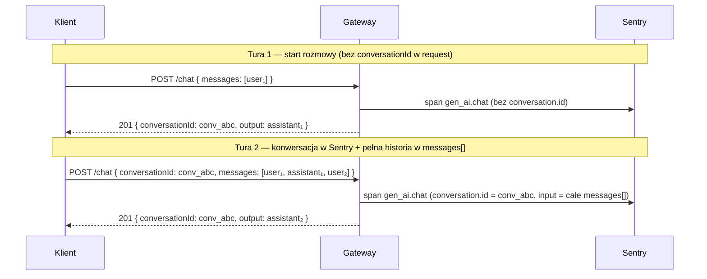

# Śledzenie rozmów (`conversationId`)

## Cel

Gateway obsługuje opcjonalne pole **`conversationId`** w body żądań czatu (`POST /api/v1/chat` i `POST /api/v1/chat/stream`). Służy ono do:

1. **Zwracania ID sesji do klienta** (echo lub nowe `conv_<uuid>`) — front może zapamiętać i wysłać w kolejnej turze.
2. **Grupowania metryk LLM w Sentry** pod `gen_ai.conversation.id` — **tylko gdy klient poda `conversationId` w żądaniu**.

Gateway jest **stateless**: nie przechowuje historii rozmowy. Pełna treść wątku zależy od tablicy **`messages[]`** wysłanej przez klienta w każdym requeście.

Implementacja: `src/chat/helpers/conversation-id.ts` (`getClientConversationId`, `getOrCreateConversationIdForResponse`), `src/chat/helpers/metrics.ts` (`buildLlmMetricsContext` — używane z `ChatProviderCallService`), `src/observability/ai-metrics/adapters/sentry-ai-metrics.adapter.ts`.

---

## Dwa tryby logowania w Sentry

Każde wywołanie providera (poza cache hit) generuje span `op: gen_ai.chat`.

| Tryb | Warunek w request | `gen_ai.conversation.id` | Widok **Explore → Conversations** |
|------|-------------------|--------------------------|-----------------------------------|
| **Pojedyncza wiadomość** | Brak `conversationId` w body | **Nie** | Span w Traces; nie jest grupowany jako rozmowa |
| **Konwersacja** | Jest `conversationId` w body | **Tak** (wartość z body) | Wiele spanów z tym samym ID = jedna rozmowa |

Przy `SENTRY_INCLUDE_PROMPTS=true` (zob. `konfiguracja.md`) każdy span może mieć:

- `gen_ai.input.messages` — zawartość **`messages[]` z bieżącego requestu** (format Sentry: `role` + `parts[{ type: text, content }]`)
- `gen_ai.output.messages` — odpowiedź modelu z **tego** wywołania LLM

`gen_ai.conversation.id` ustawia wyłącznie `SentryAiMetricsAdapter`, gdy `context.conversationId` pochodzi z body klienta (`getClientConversationId`).

---

## Logowanie konwersacji od drugiej wiadomości (zalecany przepływ)

Typowy scenariusz: pierwsza tura **bez** `conversationId`, kolejne **z** ID zwróconym przez gateway.



### Tura 1 (pierwsza wiadomość użytkownika)

**Request:** tylko `modelAlias` + `messages` (np. jedna wiadomość `user`). **Bez** `conversationId`.

**Sentry:**

- Span `gen_ai.chat` z input/output tej tury (gdy `SENTRY_INCLUDE_PROMPTS=true`).
- **Brak** `gen_ai.conversation.id` — to nie jest wpis w **Conversations**, tylko pojedyncze wywołanie LLM.

**Response:** gateway zwraca **`conversationId`** = `conv_<uuid>` (wygenerowane). Klient **powinien zapisać** to ID na turę 2.

### Tura 2 i dalsze (konwersacja w Sentry)

**Request:**

- **`conversationId`** — to samo co z tury 1 (echo lub własne UUID klienta od początku).
- **`messages[]`** — **pełna historia** widoczna dla modelu, w tym:
  - pierwsze pytanie użytkownika (`user`),
  - pierwsza odpowiedź assistenta (`assistant`) — **klient musi ją dodać** z odpowiedzi tury 1,
  - kolejne tury.

**Sentry:**

- `gen_ai.conversation.id` = `conversationId` z body.
- W `gen_ai.input.messages` **tej** tury widać całą przekazaną historię (w tym fragment startowy z tury 1), nawet jeśli tura 1 nie miała `conversation.id`.
- `gen_ai.output.messages` = tylko odpowiedź z **bieżącego** wywołania.

**Uwaga o grupowaniu spanów:** span z tury 1 **nie** zostanie retroaktywnie dołączony do tej samej encji Conversations co tura 2+. W UI konwersacji zobaczysz wątek od momentu, gdy zacząłeś wysyłać `conversationId`, z bogatym inputem na kolejnych spanach. Treść startowa jest w **`messages[]`**, nie w osobnym spanie zgrupowanym pod tym samym ID.

### Obowiązek klienta przy starcie od tury 2

Jeśli chcesz **pełną treść rozmowy** w Sentry (w tym pierwszą parę pytanie–odpowiedź):

1. Po turze 1 zapisz `output.text` jako wiadomość `assistant` w lokalnej historii.
2. Od tury 2 wysyłaj **rosnącą** tablicę `messages[]` + **`conversationId`**.

Bez `assistant` z tury 1 w `messages[]` Sentry zobaczy tylko to, co jest w bieżącym requeście (np. samo `user₂`).

---

## Kontrakt API

### Request

```json
{
  "modelAlias": "chat-default",
  "messages": [
    { "role": "user", "content": "Cześć" },
    { "role": "assistant", "content": "Witaj!" },
    { "role": "user", "content": "Kontynuuj" }
  ],
  "conversationId": "conv_123e4567-e89b-12d3-a456-426614174000"
}
```

| Pole | Wymagane | Opis |
|------|----------|------|
| `messages` | Tak | 1–150 elementów; role `user` \| `assistant` \| `tool` (`toolCallId` wymagane); `content` max 3000 (user/assistant) lub 32000 (`tool`). Historia — **zawsze od klienta**. |
| `conversationId` | Nie | String w formacie **`conv_<uuid>`** (regex w `ChatRequestDto`). **W request:** włącza grupowanie Sentry (`gen_ai.conversation.id`). **Brak w request:** span bez conversation id; gateway zwraca nowe `conv_<uuid>` w odpowiedzi. |

Walidacja: `@IsOptional()`, `@IsString()`, `@Matches(/^conv_[0-9a-f]{8}-…/)`. Niepoprawny format (np. `conv_abc`) → **400** (`VALIDATION_FAILED`, komunikat: `conversationId must be conv_<uuid>`).

### Odpowiedź

| Tryb | Gdzie jest `conversationId` |
|------|----------------------------|
| `POST /api/v1/chat` | JSON `ChatResponse.conversationId` |
| `POST /api/v1/chat/stream` | SSE `event: meta` |

Zasady:

- Klient **podaje** `conversationId` → odpowiedź **echo** (to samo).
- Klient **nie podaje** → odpowiedź zawiera **nowe** `conv_<uuid>` (do adopcji w kolejnej turze).

### Różnica: pole w odpowiedzi vs pole w request (metryki)

| | W **response** | W **request** (Sentry Conversations) |
|---|----------------|--------------------------------------|
| Brak pola | Zwracane `conv_<uuid>` | Brak `gen_ai.conversation.id` |
| Jest pole | Echo | `gen_ai.conversation.id` + grupowanie tur |

---

## Cache a metryki

Przy **cache hit** (`POST /api/v1/chat`) gateway **nie** wywołuje providera i **nie** emituje nowego spana LLM (`observeLlmCall` jest pomijane). Odpowiedź może pochodzić z cache — bez śladu w Sentry dla tej tury.

---

## Konfiguracja Sentry

| Zmienna | Znaczenie |
|---------|-----------|
| `SENTRY_DSN` | Wymagane do wysyłki |
| `AI_METRICS_BACKEND=sentry` | Adapter metryk LLM (`AiMetricsModule` / `ObservabilityModule`); w **production** domyślnie Sentry gdy `AI_METRICS_BACKEND` nie ustawiony na `noop` (wymaga `SENTRY_DSN`) |
| `SENTRY_TRACES_SAMPLE_RATE` | Np. `1.0` na test |
| `SENTRY_INCLUDE_PROMPTS=true` | `gen_ai.input.messages` / `gen_ai.output.messages` na spanach |
| `streamGenAiSpans: true` | W `src/instrument.ts` — **wymagane** dla widoku Conversations |

Szczegóły env: `konfiguracja.md`.

---

## Przykład klienta (tura 1 → tura 2)

```typescript
let conversationId: string | undefined;
const messages: Array<{ role: 'user' | 'assistant'; content: string }> = [];

async function sendUserTurn(userText: string) {
  messages.push({ role: 'user', content: userText });

  const res = await fetch('/api/v1/chat', {
    method: 'POST',
    headers: {
      'Content-Type': 'application/json',
      'X-Gateway-Key': process.env.GATEWAY_KEY!,
    },
    body: JSON.stringify({
      modelAlias: 'chat-default',
      messages,
      ...(conversationId ? { conversationId } : {}),
    }),
  });

  const data = await res.json();
  conversationId = data.conversationId ?? conversationId;
  messages.push({ role: 'assistant', content: data.output.text });
  return data;
}

// Tura 1: brak conversationId w request → Sentry: pojedynczy span
await sendUserTurn('Cześć');

// Tura 2: conversationId z odpowiedzi + pełna historia w messages[]
await sendUserTurn('Opowiedz więcej');
```

---

## FAQ

**Czy muszę wysłać `conversationId` w pierwszej wiadomości?**  
Nie. Pierwsza tura może być bez niego; weź `conversationId` z odpowiedzi i wyślij od drugiej tury, jeśli chcesz Conversations w Sentry.

**Czy gateway przechowuje historię?**  
Nie. Pełna historia = `messages[]` w każdym requeście.

**Czy pierwsza tura trafi do tej samej konwersacji w Sentry co druga?**  
Nie jako osobny span w grupie — tura 1 nie ma `conversation.id`. Treść tury 1 trafia do Sentry w **`gen_ai.input.messages`** tury 2+, jeśli klient doda `user` + `assistant` do `messages[]`.

**Czy mogę generować `conversationId` na froncie od tury 1?**  
Tak — wtedy wszystkie tury od początku mają `gen_ai.conversation.id` (scenariusz „konwersacja od pierwszej wiadomości”).

**Streaming?**  
Ten sam kontrakt: `conversationId` w body; w SSE `meta` zwracane ID (echo lub `conv_*`).

Powiązane: [`openapi.json`](../../openapi.json), `dokumentacja_api.md`, `data_flow.md`, `spec/SPEC-CHAT.md` (scenariusz D).
