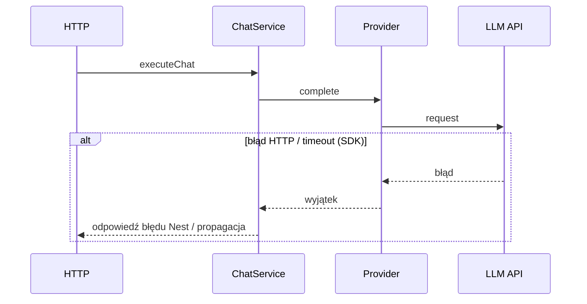
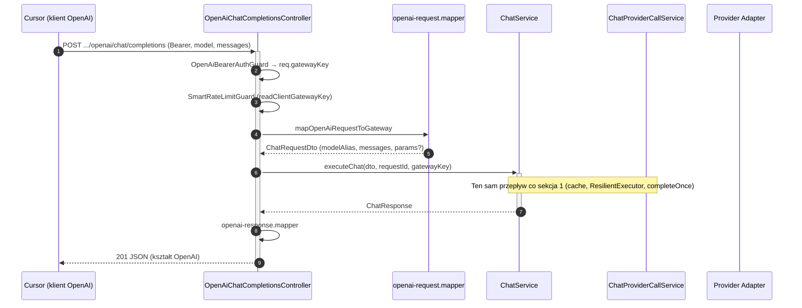
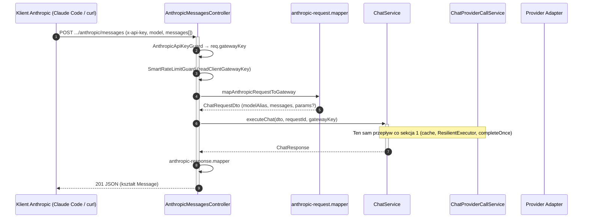

# Przepływ danych (data flow) — AI Provider Gateway

Dokument uzupełnia `dokumentacja_api.md` i `architektura.md`: pokazuje kierunek danych między klientem, warstwą HTTP (NestJS), logiką aplikacyjną oraz adapterami providerów.

**Konfiguracja:** przy starcie ładowany jest `gateway.config.yaml` (`gateway-config.schema.ts` + `configuration.ts`). Po sklonowaniu: `gateway config:init` lub ręczne uzupełnienie `.env`. Klucze providerów: **per `apiKeyRef`** w YAML dla włączonych instancji — `konfiguracja.md`.

## Legenda uczestników

| Skrót | Znaczenie |
|-------|-----------|
| **Klient** | Dowolny klient HTTP (aplikacja, serwis, BFF). |
| **HTTP** | Kontroler + walidacja DTO + odpowiedź. |
| **ChatService** | Wspólne `prepareRequestForExecution` (ingress, tooling/thinking, **cooldown przed cache**). Cache w `executeChat` (JSON) oraz na streamie (`resolveStreamCache` → hit: `StreamCacheReplayService` / miss: `executeStreamMiss` + `setCachedIfAllowed`): polityka aliasu → exact KV → semantic HASH (trim last-user) → embed+KNN; na missie dual-write **await** exact `SET NX` + semantic `HSETNX` (bez promocji semantic→exact; **bez zapisu przy `didFallback`**). Singleflight in-process na identity key **tylko JSON** (stream bez soft singleflight; v2: distributed lock w Redis — planowane). `ResilientExecutor`, budowa odpowiedzi gateway (`id`, `conversationId`, `effectiveModelAlias`). |
| **ChatProviderCallService** | Pojedyncze wywołanie adaptera: `buildProviderInputForAlias`, `resolveProviderCallOptions`, `AiMetricsService.observeProviderCall` / `observeProviderStream`, `AppMetricsService` (RED), emisja SSE `meta`/`delta` (live miss). |
| **ResilientExecutor** | `src/chat/resilience/` — retry na aliasie żądanym (`policy.retry`, `policy.timeoutMs` → `buildRetryPolicyFromResolved`), potem opcjonalnie alias `fallback` z YAML (jeden hop). Przy timeout: `AbortSignal` do `completeOnce` / `streamOnce` → adapter SDK; odpowiedź `PROVIDER_TIMEOUT` (504). |
| **Registry** | `ProviderRegistryService` — mapowanie aliasu z YAML na **`providerInstance`** → `AIProvider` + `modelId`. |
| **Provider** | Instancja `AIProvider` (fabryka + klucz API per wpis w YAML). |
| **LLM API** | Zewnętrzny serwis providera. |
| **ResponseCache (ExactCache)** | `ResponseCacheService` — odczyt/zapis exact cache dla **`POST /api/v1/chat`** i **`POST /api/v1/chat/stream`** oraz streamów fasad (wspólny magazyn; klucz hash: `modelAlias`, `clientId`, `messages`, sygnatura system promptu, efektywne parametry; **`metadata` wyłączone**); odczyt walidowany `CachedChatResponseSchema`; zapis Redis: first-writer-wins (`SET … NX`). |
| **SemanticCache** | `SemanticCacheService` — tani HASH po przyciętym last-user (`getByTextIdentity`, bez embed); przy missie embedding ostatniej wiadomości `role: user` (goły tekst, `qwen3-embedding:0.6b`) → KNN w Redis Search → próg podobieństwa cosinusowego (domyślnie 0.85). Magazyn równoległy do exact KV (bez promocji). TTL = `CACHE_TTL`. Fail-open: błąd embedding/Search → wywołanie providera. Pominięty dla tooling, `clientId === 'unknown'` (nie dla streamingu — stream używa tej samej warstwy). Zapis: `HSETNX` pola `reply` (first-writer-wins); reuse wektora z lookupu albo — gdy `embed` nie był wołany — może zrobić pierwszy `embed` (bez retry po padniętym lookupie). |
| **StreamCacheReplay** | `StreamCacheReplayService` — przy hicie cache na SSE: `meta` z `cached*` → `delta` po 64 znakach z `output.text` → `done` (delay 0). |
| **Metrics** | **`AiMetricsService`** (Sentry LLM spans) + **`AppMetricsService`** (Prometheus RED); span `gen_ai.chat` per wywołanie LLM; **`gen_ai.conversation.id`** tylko gdy klient poda `conversationId` (`conversation_tracking.md`). Health gauges odświeżane przy `GET /metrics`. |
| **Fasada integracji** | Kontroler `src/integrations/openai` lub `anthropic` + mappery — tłumaczenie kontraktu vendora na `ChatRequestDto`, potem ten sam `ChatService` co natywny czat (`integracje.md`). |

---

## 0. Wspólny szkielet: walidacja, wybór modelu

```mermaid
sequenceDiagram
  autonumber
  participant K as Klient
  participant H as HTTP (ChatController)
  participant S as ChatService
  participant E as ExactCache (ResponseCacheService)
  participant SC as SemanticCache (SemanticCacheService)

  K->>+H: POST /api/v1/chat (JSON)
  H->>H: ValidationPipe (DTO)
  Note over H: RequestIdMiddleware (req.requestId + response header x-request-id); GatewayKeyGuard + SmartRateLimitGuard na czacie
  H->>+S: executeChat(request)
  S->>S: prepareRequestForExecution (cooldown przed cache)
  S->>E: lookup exact (klucz hash)
  alt exact HIT
    E-->>S: zapisana odpowiedź (cached: true)
    S-->>-H: 201 JSON (cached, exact)
  else exact MISS / wyłączony
    S->>SC: lookup semantyczny (HASH last-user, potem embedding + KNN) — pominięty dla tooling / unknown clientId / wielotury
    alt semantic HIT (HASH albo similarity >= próg, ta sama partycja)
      SC-->>S: zapisana odpowiedź (cached: true)
      S-->>-H: 201 JSON (cached, semantyczny)
    else semantic MISS / wyłączony / fail-open
      Note over S: resolve + provider (szczegóły: sekcja 1)
      Note over S: dual-write await exact SET + semantic upsert (bez promocji)
      S-->>-H: wynik lub wyjątek HTTP
    end
  end
  H-->>-K: 201 JSON lub błąd
```

Przy missie semantycznym `executeChat` dual-write **przed** HTTP 201: `await` exact SET **i** semantic upsert (bez promocji semantic→exact; SET dostaje stan embed z lookupu). Semantic-only (`CACHE_ENABLED=false`) jest wspierany. TTL wektorów = `CACHE_TTL`. Zapis semantyczny tylko dla żądań jednoturowych w tej samej partycji TAG co lookup (`modelAlias` + `clientId` + `embeddingModel` + `systemSignature` + `callParams`).

---

## 1. Standard `POST /api/v1/chat` — sukces (201)

```mermaid
sequenceDiagram
  autonumber
  participant K as Klient
  participant H as HTTP
  participant S as ChatService
  participant PC as ChatProviderCallService
  participant C as ResponseCache
  participant R as ProviderRegistry
  participant M as AiMetricsService
  participant P as Provider Adapter
  participant A as LLM API

  K->>+H: POST /api/v1/chat (modelAlias, messages, conversationId?, params?)
  H->>H: walidacja DTO
  H->>+S: executeChat
  S->>S: prepareRequestForExecution (cooldown przed jakimkolwiek I/O cache)
  S->>S: conversationId response (echo/conv_*)
  S->>+R: resolve(modelAlias)
  R-->>-S: AIProvider + policy.params
  S->>S: resolveProviderCallOptions(policy, body.params)
  S->>C: getCachedIfAllowed (polityka aliasu → exact KV → semantic HASH → KNN)
  alt trafienie w cache (provider włączony w YAML; wpis przeszedł CachedChatResponseSchema)
    C-->>S: JSON (z cached/cachedAt/cacheSource)
    S-->>H: odpowiedź
  else brak wpisu
    S->>S: ResilientExecutor (retry / fallback / timeout + AbortSignal)
    S->>+PC: completeOnce (per alias w łańcuchu; signal)
    PC->>PC: buildProviderInputForAlias + resolveProviderCallOptions
    PC->>+M: observeLlmCall
    M->>+P: complete(input, modelId, options)
    P->>+A: request do providera
    A-->>-P: response
    P-->>-M: ProviderChatResponse
    M-->>-PC: wynik + span Sentry
    PC-->>-S: response + resolved
    S->>C: await setCachedIfAllowed (exact SET + semantic upsert)
    S-->>-H: ChatResponse (id, usage, requestId, conversationId, effectiveModelAlias?, …)
  end
  H-->>-K: 201 JSON (+ conversationId)
```

**Uwagi:** opcjonalne **`params`** w body są scalane z `policy.params` w YAML (`resolveProviderCallOptions`) przed cache i wywołaniem providera. Odpowiedź z cache zawiera **`cached: true`**, **`cachedAt`** i **`cacheSource`** (`exact` | `semantic`); pole **`requestId`** jest stemplowane z **bieżącego** żądania (nie jest w Redis). **`id`** (`gw_*`) pochodzi z zapisanego payloadu. Zapis tylko przy `finishReason=stop`, niepustym tekście i bez `toolCalls` (`shouldStoreChatResponse`). Błąd **`MODEL_NOT_ALLOWED`** może powstać już po `resolve`, przed wywołaniem LLM.

---

## 2. Standard `POST /api/v1/chat` — błąd

Odpowiedzi JSON błędów **natywnego czatu** są w envelope **`ErrorEnvelope`** (`openapi.json`) z polami `{statusCode, code, message, requestId, details?}` — `GlobalExceptionFilter` (global). Fasady OpenAI/Anthropic używają lokalnych filtrów i własnych kształtów błędów (schematy w `openapi.json`). **`code`** (natywny czat) pochodzi z payloadu wyjątku lub z domyślnego mapowania statusu; pełny słownik: `dictionary.md`.



---

## 3. Streaming `POST /api/v1/chat/stream` — sukces (SSE)

Zgodnie z `openapi.json` i kodem (`ChatStreamController`, `ChatService.resolveStreamCache` / `executeStreamMiss` / `replayStreamCacheHit`): **najpierw** prepare + cooldown + lookup cache, **potem** nagłówki SSE. Hit: replay (`meta` z `cached*` → `delta`×64 → `done`). Miss: live `meta`/`delta`/`done` + opcjonalny zapis do wspólnego magazynu. Payload `done` może zawierać: `usage` (z `totalTokens`), `toolCalls`, `finishReason`, opcjonalnie `usageDetails`, `thinkingContent`, `systemFingerprint`, `warnings`, `effectiveModelAlias`.

```mermaid
sequenceDiagram
  autonumber
  participant K as Klient
  participant H as HTTP (ChatStreamController)
  participant S as ChatService
  participant C as CacheGuard / Replay
  participant PC as ChatProviderCallService
  participant R as ProviderRegistry
  participant M as AiMetricsService
  participant P as Provider Adapter
  participant A as LLM API

  K->>+H: POST /api/v1/chat/stream
  H->>H: walidacja DTO + validateForStreaming
  H->>+S: resolveStreamCache (prepare + cooldown + getCachedIfAllowed)
  alt cooldown
    S-->>H: RATE_LIMITED (JSON, bez SSE)
    H-->>K: 429 ErrorEnvelope
  else cache hit
    S-->>-H: hit (cached, cacheSource)
    H->>H: nagłówki SSE + flushHeaders
    H->>S: replayStreamCacheHit
    S->>C: StreamCacheReplayService (meta cached* → delta×64 → done)
    H-->>K: SSE hit
  else cache miss
    S-->>-H: miss (+ embedState?)
    H->>H: nagłówki SSE + flushHeaders
    H->>+S: executeStreamMiss
    S->>S: ResilientExecutor (retry / fallback / timeout + AbortSignal)
    S->>+PC: streamOnce (emit przez callback; signal)
    PC->>PC: buildProviderInputForAlias
    PC->>M: observeLlmStream
    PC-->>H: SSE meta (id, conversationId, effectiveModelAlias?)
    H-->>K: event meta
    PC->>+P: stream(...)
    P->>+A: streaming request
    loop fragmenty
      A-->>P: chunk
      P-->>PC: tekst
      PC-->>H: delta
      H-->>K: SSE: event delta
    end
    S-->>H: emit done (+ setCachedIfAllowed gdy !didFallback)
    H-->>-K: SSE: event done
  end
```

---

## 4. Fasada OpenAI — `POST /api/v1/openai/chat/completions`



**Streaming (`stream: true`):** kontroler → `resolveStreamCache` (przed headers) → hit: `X-Gateway-Cache` + replay przez mapper OpenAI / miss: `executeStreamMiss` → `openai-stream.mapper` (SSE OpenAI; body vendora **bez** pól `cached*`). Slot równoległego streamu — w kontrolerze fasady, nie w `StreamCleanupInterceptor` (ścieżka bez `/stream` w URL).

---

## 5. Fasada Anthropic — `POST /api/v1/anthropic/messages`



**Streaming (`stream: true`):** kontroler → `resolveStreamCache` (przed headers) → hit: `X-Gateway-Cache` + replay przez mapper Anthropic / miss: `executeStreamMiss` → `anthropic-stream.mapper` (SSE Anthropic; body vendora **bez** pól `cached*`). Finalne `message_delta.usage` — przez `anthropic-usage.mapper.ts` (parity z JSON). Bloki `thinking` — w fazie `done`, gdy gateway zwrócił `thinkingContent`. Slot równoległego streamu — w `AnthropicMessagesController`, analogicznie do OpenAI.

---

Powiązane: [`openapi.json`](../../openapi.json), `dokumentacja_api.md`, `architektura.md`, `integracje.md`, `dictionary.md` (kody `RATE_LIMITED` / `PROVIDER_RATE_LIMITED`), `konfiguracja.md`.
