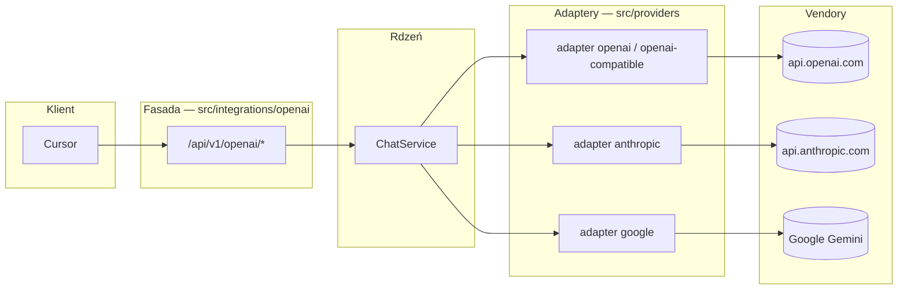
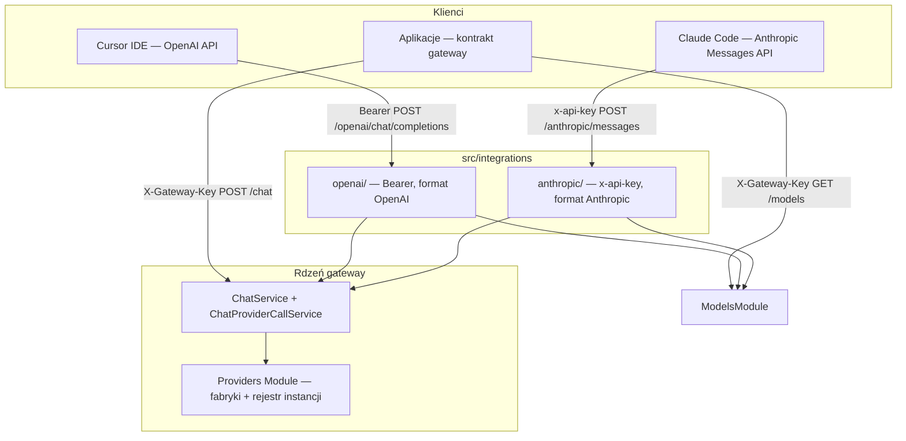

# Fasady oficjalnych kontraktów — AI Provider Gateway

Moduł **`src/integrations/`** dodaje **równoległe kontrakty HTTP** dla klientów, którzy oczekują oficjalnego kształtu API vendora (OpenAI lub Anthropic), bez zmiany rdzenia gatewaya (`POST /api/v1/chat`, warstwa providerów w `src/providers/`).

## Fasada ≠ provider runtime

| | **Fasada** (`src/integrations/`) | **Provider runtime** (`src/providers/`) |
|---|----------------------------------|----------------------------------------|
| **Cel** | Kompatybilność **kontraktu HTTP** z IDE i innymi aplikacjami oczekującymi tych kształtów (np. Cursor, Claude Code) | Wywołanie LLM u vendora przez SDK |
| **OpenAI** | `/api/v1/openai/*` — kształt OpenAI API | `type: openai` / `openai-compatible` w YAML — adapter SDK (`src/providers/`) |
| **Anthropic** | `/api/v1/anthropic/*` — kształt Anthropic Messages API | `type: anthropic` w YAML — adapter SDK |
| **Gwarancja backendu** | **Brak** — fasada nie wiąże się z vendorem | Tak — `providerInstance` + `modelId` w konfiguracji |

Fasady istnieją, ponieważ OpenAI Chat Completions API i Anthropic Messages API stały się **standardami** dla IDE oraz innych klientów oczekujących tych oficjalnych kształtów. Gateway implementuje te kształty HTTP nad jednym `ChatService`; **kierowanie zapytań do providera** odbywa się wyłącznie przez **`modelAlias`** (`model` w fasadzie) i `gateway.config.yaml`, nie przez wybór trasy `/openai` vs `/anthropic`.

Pełna definicja terminów: [`dictionary.md`](dictionary.md) (sekcja „Fasada vs provider runtime”).



Ścieżka fasady i ścieżka adaptera są **ortogonalne** — wybór `/openai` vs `/anthropic` nie wybiera vendora LLM.

## Filozofia

| Zasada | Opis |
|--------|------|
| **Trzy kontrakty, jeden silnik** | Kontrolery i mappery tłumaczą HTTP; **`ChatService`** pozostaje jedynym orchestratorem czatu (cache, retry, fallback, limity). Katalog modeli — wspólny **`GatewayModelsCatalogService`** (`ModelsModule`) + mappery fasad. |
| **Anti-corruption layer** | Podmoduły `openai/` i `anthropic/` są izolowane — zmiana formatu OpenAI nie wpływa na Messages API. |
| **Bez zmiany natywnego API** | `ChatController` / `ChatStreamController` i warstwa providerów pozostają punktem odniesienia dla aplikacji pisanych pod kontrakt gateway. |
| **Separacja kluczy** | Klucze **klientów** (IDE → gateway) ≠ klucze **providerów** (gateway → LLM w `.env`). |

## Zakres fasad

| Element | Opis |
|---------|------|
| Katalogi `src/integrations/{openai,anthropic}/` | Podmoduły fasad OpenAI i Anthropic |
| `IntegrationsModule` w `AppModule` | Rejestracja fasad w aplikacji |
| `Request.gatewayKey` w `src/common/types/express.d.ts` | Typ Express dla klucza klienta po auth |
| Eksport `ChatService`, `SmartRateLimitGuard` z `ChatModule` | Fasady importują guard z `src/guards/smart-rate-limit-guard.ts` przez `@OpenAiAuth()` / `@AnthropicAuth()` |
| `readClientGatewayKey` + `SmartRateLimitGuard` / `StreamCleanupInterceptor` | Wspólny odczyt klucza klienta (`src/common/readClientGatewayKey.ts`) |
| **Fasada OpenAI** (`OpenAiModule`) — auth, models, completions JSON + stream | [`integracja_openai_kontrakt.md`](integracja_openai_kontrakt.md); models przez `GatewayModelsCatalogService` + `openai-models.mapper.ts` |
| **Fasada Anthropic** (`AnthropicModule`) — auth, models, messages JSON + stream | [`integracja_anthropic_messages.md`](integracja_anthropic_messages.md); models przez `GatewayModelsCatalogService` + `anthropic-models.mapper.ts` |
| **ModelsModule** — natywny `GET /api/v1/models` | Wspólny katalog aliasów dla natywnego API i fasad |
| Testy E2E kontraktu HTTP fasad (mock adapterów runtime) | `test/e2e/gateway-chat*.e2e-spec.ts`, `gateway-chat-openai.e2e-spec.ts`, `openai-facade*.e2e-spec.ts`, `anthropic-facade*.e2e-spec.ts`, `facade-models.e2e-spec.ts`, `native-models.e2e-spec.ts` — [`testy.md`](testy.md) |

Szczegóły konfiguracji klientów (Cursor, Claude Code): **`integracja_openai_kontrakt.md`**, **`integracja_anthropic_messages.md`**.

## Widok architektury



## Trzy powierzchnie API

Globalny prefiks aplikacji: **`/api/v1`** (`API_GLOBAL_PREFIX` w `src/setup.app.ts`).

| Powierzchnia | Base URL (przykład) | Auth klienta | Główne trasy |
|--------------|---------------------|--------------|--------------|
| **Natywna** | `http://host:3000/api/v1` | `X-Gateway-Key` | `GET /models`, `POST /chat`, `POST /chat/stream` |
| **OpenAI** | `http://host:3000/api/v1/openai` | `Authorization: Bearer <klucz_klienta>` | `GET /models`, `POST /chat/completions` |
| **Anthropic** | `http://host:3000/api/v1/anthropic` | `x-api-key` (lub Bearer) | `GET /models`, `POST /messages` |

IDE ustawia **Base URL** z segmentem integracji; klient dokleja ścieżki ze specyfikacji vendora (`/models`, `/chat/completions`, `/messages`) — ten sam wzorzec co `https://api.openai.com/v1` + `/chat/completions`.

**Natywny katalog modeli:** `GET /api/v1/models` — własny kontrakt gateway (`GatewayModelDto`), nie kształt OpenAI ani Anthropic. Fasady nadal wystawiają `/openai/models` i `/anthropic/models` w formacie vendora; wszystkie trzy powierzchnie czytają ten sam YAML przez **`GatewayModelsCatalogService`**.

Stałe ścieżek w `src/integrations/integrations.constants.ts`:

- `OPENAI_INTEGRATION_PATH = 'openai'`
- `ANTHROPIC_INTEGRATION_PATH = 'anthropic'`

## Mapowanie modeli

Pole **`model`** w żądaniu fasady (OpenAI / Anthropic) = **`modelAlias`** z `gateway.config.yaml` (np. `chat-default`, `claude-sonnet`). Vendorowy `modelId` pozostaje w konfiguracji; klient IDE nie podaje go bezpośrednio.

`GET .../models` (fasada lub natywny `/models`) zwraca aliasy z `gateway.config.yaml`, w formacie odpowiedniej powierzchni (gateway DTO vs OpenAI list vs Anthropic list).

## Autoryzacja — dwa poziomy

### Klucze klientów (frontend / IDE → gateway)

Wszystkie trzy powierzchnie weryfikują **tę samą allowlistę** (`gatewayKey.allowList` z `.env` / `gateway.config.yaml`):

| Powierzchnia | Nagłówek | Guard |
|--------------|----------|-------|
| Natywna | `X-Gateway-Key` | `GatewayKeyGuard` |
| OpenAI | `Authorization: Bearer` | `OpenAiBearerAuthGuard` → `req.gatewayKey` |
| Anthropic | `x-api-key` (priorytet) lub Bearer | `AnthropicApiKeyGuard` → `req.gatewayKey` |

Kody błędów wewnętrzne (`GATEWAY_KEY_MISSING`, `GATEWAY_KEY_INVALID`) są mapowane na format OpenAI (`error.type`) lub Anthropic w **lokalnych filtrach** (`OpenAiExceptionFilter`, `AnthropicExceptionFilter`). `GlobalExceptionFilter` nadal obsługuje natywne API.

### Klucze providerów (gateway → LLM)

Adaptery w `src/providers/` używają kluczy z env wskazanych przez **`apiKeyRef`** w YAML (np. `ANTHROPIC_PRIMARY_API_KEY`, `GOOGLE_API_KEY`) — **nigdy** klucza klienta z IDE.

## Smart rate limit

Fasady muszą współdzielić **`SmartRateLimiterService`** z natywnym API.

**Kolejność guardów (wymagana):**

1. Guard auth fasady (ustawia `req.gatewayKey`)
2. `SmartRateLimitGuard` (token bucket RPS, równoległe streamy)

**Cooldown** po 429 od providera: **`prepareRequestForExecution`** (wspólne dla `executeChat` i `resolveStreamCache` / stream miss) → `checkCooldown`; **ustawienie** cooldownu — `ChatErrorHandlerService.handleProviderError` → `setCooldown` (obie ścieżki). **Cache odpowiedzi** — JSON (`executeChat`) oraz stream (`resolveStreamCache` / `executeStreamMiss`); fasady: nagłówek `X-Gateway-Cache` na hicie JSON i stream.

**Helper `readClientGatewayKey(req)`** (`src/common/readClientGatewayKey.ts`):

- integracje: `req.gatewayKey` po guardzie fasady,
- natywne API: `X-Gateway-Key` (`readGatewayKeyHeader`).

**Równoległe streamy:** natywny `POST /chat/stream` — `SmartRateLimitGuard` (URL kończy się na `/stream`) + `StreamCleanupInterceptor`. Fasady OpenAI / Anthropic (`stream: true` w body) — **rezerwacja i zwolnienie slotu w kontrolerze fasady** (guard nie parsuje body `stream`).

## Przepływ żądania (implementacja)

1. HTTP → kontroler fasady + walidacja DTO vendora.
2. Mapper request → `ChatRequestDto` (`modelAlias`, `messages`, opcjonalnie `params`, `metadata`, `tooling` — tools/tool_calls z kontraktu vendora).
3. `ChatService.executeChat` / `executeStream` z profilem ingress (`facade-openai` / `facade-anthropic`), `validateChatIngress`, `req.gatewayKey` i `req.requestId`.
4. Mapper response / stream → format OpenAI lub Anthropic (Anthropic: `finishReason` → `stop_reason` przez `anthropic-stop-reason.mapper.ts`).
5. Pola specyficzne dla gateway (`provider`, `cached`, `conversationId`) **nie** są eksponowane w fasadach MVP.

## Limity walidacji ingress (`validateChatIngress`)

Gateway stosuje **różne profile walidacji** dla natywnego API i fasad oficjalnych kontraktów:

| Profil | Endpoint | Max messages | Max content (user/assistant) | Max content (tool) |
|--------|----------|--------------|------------------------------|---------------------|
| `native` | `/api/v1/chat`, `/api/v1/chat/stream` | 150 | 3000 | 32000 |
| `facade-openai` | `/api/v1/openai/chat/completions` | 15000 | 128000 | 128000 |
| `facade-anthropic` | `/api/v1/anthropic/messages` | 15000 | 128000 | 128000 |

**Implementacja:** funkcja `validateChatIngress()` w `src/chat/validation/chat-ingress.validator.ts` — wywoływana w `ChatService.executeChat` / `executeStream` przed orkiestracją (profile: `ChatIngressProfile` w `chat-ingress.types.ts`; limity: `INGRESS_LIMITS` w `chat-ingress.constants.ts`).  
**Testy:** `src/chat/validation/chat-ingress.validator.spec.ts`, E2E w `test/e2e/` (m.in. `gateway-chat.e2e-spec.ts`, `openai-facade.e2e-spec.ts`).

## Streaming

| API | Format strumienia |
|-----|-------------------|
| Natywny | SSE gateway: `meta` → `delta` → `done` (`done`: `usage`, `toolCalls`, `finishReason`, opcjonalnie `usageDetails`, `thinkingContent`, `systemFingerprint`, `warnings`, `effectiveModelAlias`) |
| OpenAI | SSE zgodny z OpenAI Chat Completions (`data: {...}`); usage w finalnym chunku tylko gdy `stream_options.include_usage` lub `include_usage` |
| Anthropic | SSE zgodny z Anthropic Messages (`message_start`, `content_block_*`, `message_delta`, `message_stop`); finalne `message_delta.usage` z `input_tokens`, `output_tokens` i polami cache; bloki `thinking` w fazie `done` gdy upstream zwrócił `thinkingContent` |

Wewnętrznie fasady korzystają z `ChatProviderCallService.streamOnce` i mapują zdarzenia gateway na format vendora (`openai-stream.mapper.ts`, `anthropic-stream.mapper.ts`; usage Anthropic — wspólny `anthropic-usage.mapper.ts` z JSON).

## Błędy i filtry

- **Natywne API:** `GlobalExceptionFilter` → `ErrorEnvelope`.
- **Fasady:** lokalne filtry na kontrolerach (`@OpenAiAuth()`, `@AnthropicAuth()`) — kształt JSON jak u vendora, z zachowaniem nagłówka **`x-request-id`**.

## Ograniczenia fasad

| Temat | Decyzja |
|-------|---------|
| `system` w messages klienta | **Ignorowane** — prompt z `src/config/system-prompt/` (źródło: serwer, nie body klienta) |
| Tools / function calling | Mapowane na wewnętrzne `tooling` (`openai-tools.mapper.ts`, `anthropic-tools.mapper.ts`); wymaga `capabilities.tools: true` na aliasie |
| Multimodal (obrazy) | Nieobsługiwane. Anthropic: **400** przy blokach `image`. OpenAI: bloki inne niż `text` są **cicho odrzucane** (`normalizeOpenAiContent`) — bez 400 |
| Cache odpowiedzi | Działa przez `ChatService` dla JSON i streamu; pola `cached*` ukryte w body fasady — sygnał: `X-Gateway-Cache` |
| `system_fingerprint` / `systemFingerprint` | Fasada OpenAI: pass-through gdy upstream zwraca (praktycznie OpenAI). Fasada Anthropic: brak pola. Anthropic/Gemini nie mają odpowiednika upstream — patrz `dictionary.md` |
| OpenAPI / Swagger | Tagi **OpenAI API** i **Anthropic API** w `openapi.json` i Swagger UI; osobne schematy błędów (`OpenAiErrorResponseDto`, `AnthropicErrorResponseDto`) |

## Struktura plików

```
src/integrations/
├── integrations.module.ts
├── integrations.constants.ts
├── openai/
│   ├── controllers/     # models, chat/completions
│   ├── mappers/         # request, response, stream, tools, messages, openai-models
│   ├── helpers/         # normalize-openai-content, openai-stream-api-description
│   ├── guards/          # Bearer auth
│   ├── filters/         # OpenAI-shaped errors
│   ├── decorators/      # @OpenAiAuth()
│   └── dtos/            # w tym openai-error-response.dto.ts
└── anthropic/
    ├── controllers/     # models, messages
    ├── mappers/         # request, response, stream, tools, anthropic-stop-reason, anthropic-usage, anthropic-models
    ├── helpers/         # anthropic-stream-api-description
    ├── guards/          # x-api-key auth
    ├── filters/
    ├── decorators/      # @AnthropicAuth()
    └── dtos/            # w tym anthropic-error-response.dto.ts
```

Katalog aliasów: **`src/models/`** (`ModelsModule`, `GatewayModelsCatalogService`) — importowany przez `OpenAiModule` i `AnthropicModule`. Kontrolery fasad wywołują `catalog.list()` / `getOne()` i mapują wynik przez `openai-models.mapper.ts` / `anthropic-models.mapper.ts`.

## Powiązane dokumenty

- `integracja_openai_kontrakt.md` — fasada oficjalnego kontraktu OpenAI (Cursor i inne klienty)
- `provider_openai_runtime.md` — adapter runtime OpenAI (`src/providers/`)
- `integracja_anthropic_messages.md` — fasada Anthropic, konfiguracja Claude Code
- `lista_endpointów.md` — pełna lista tras (w tym fasady)
- `data_flow.md` — diagramy przepływu
- `architektura.md`, `architektura_katalogi_pliki.md`
- `dictionary.md` — pojęcia (fasada, klucz klienta)
- `anty_patterny.md` — pułapki przy wielu kontraktach
- `testy.md` — testy E2E fasad i natywnego czatu
