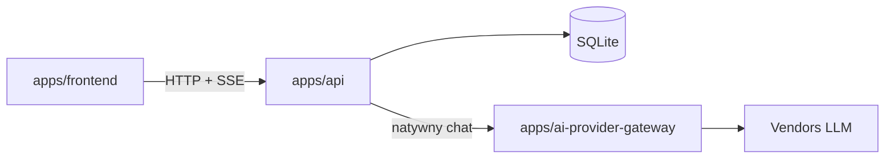
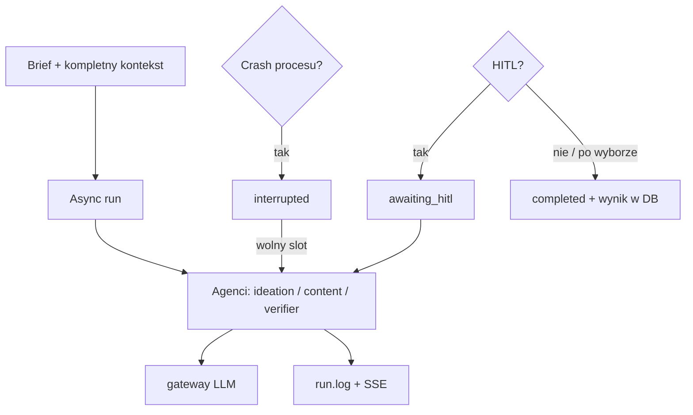

# Dokumentacja Content Chain

**Content Chain** to publiczna, self-hostowalna (MIT) aplikacja agentowa do generowania treści social media: brief → orchestracja agentów (post ideas / post content) → weryfikacja względem kontekstu firmy → zapis w DB i czytelne logi runu. Monorepo obejmuje `apps/frontend`, `apps/api` oraz `apps/ai-provider-gateway` (jedyna droga do modeli LLM). Jedna instalacja = jedna firma = jeden wspólny kontekst; MVP domyka też auth i dashboard, przy kolejności budowy backend-first.

## Jak czytać (kolejność)

1. `dokumentacja_koncepcyjna.md` — po co i dla kogo  
2. `architektura.md` — granice i style  
3. `architektura_katalogi_pliki.md` — drzewo monorepo  
4. `dokumentacja_komunikacji.md` — kontrakt HTTP / SSE / gateway  
5. `data_flow.md` — pipeline agentów i przepływy  
6. Dalej wg potrzeby: słownik, brand types, testy, deploy, security, observability, UX, anty-patterny  

## Mapa: temat → plik

| Temat | Plik |
|-------|------|
| Cel, zakres MVP, poza zakresem | `dokumentacja_koncepcyjna.md` |
| Style, BC, async run, decyzje | `architektura.md` |
| Drzewo `apps/*`, Prisma, prompty, `test/postman` | `architektura_katalogi_pliki.md` |
| API, SSE, metrics, integracja gateway | `dokumentacja_komunikacji.md` |
| Brand types / korelacja ID | `brand_types.md` |
| Słownik pojęć i kodów błędów | `dictionary.md` |
| Przepływy + schematy agentów A/B/C | `data_flow.md` |
| Pułapki stacku / projektu | `anty_patterny.md` |
| Strategia testów | `testy.md` |
| `local` / `production`, compose, backup | `deployment.md` |
| Auth, bootstrap, hasła, ekspozycja | `security.md` |
| Metryki vs logi runu; dump hopu gateway w `development` | `observability.md` |
| Widoki dashboardu, agenci aktywni, live status, opinia / gwiazdki / Edytuj | `ux_dashboard.md` |

## Schematy (skrót)

### System

### Run SM (uproszczenie)

Szczegóły węzłów, refine i korelacji ID: `data_flow.md` + `brand_types.md`. Kontrakt endpointów: `dokumentacja_komunikacji.md`.
