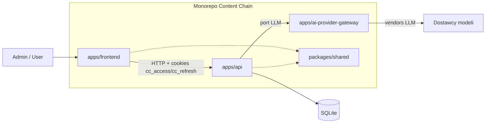
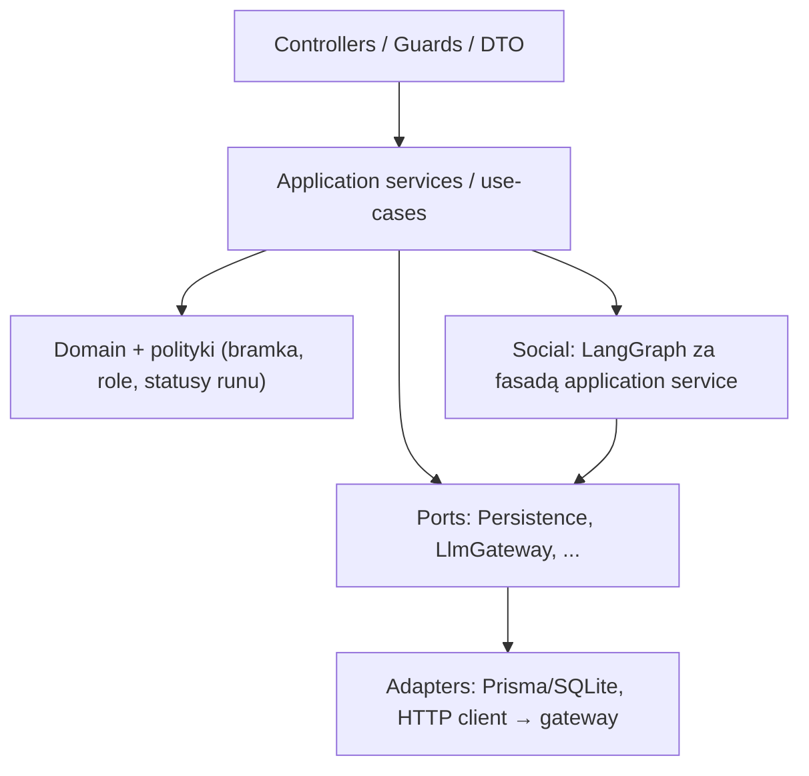

# Architektura — Content Chain

## Widok systemu

Content Chain to **modularny monolit w monorepo** z trzema osobnymi procesami runtime oraz wspólnym pakietem kontraktów.

Zmiana względem wcześniejszej wersji tego dokumentu: ścieżki aplikacji ujednolicono do `apps/api`, `apps/frontend`, `apps/ai-provider-gateway` (w rootcie monorepo, **bez** opakowania `src/apps/`). Szczegółowe drzewo: `architektura_katalogi_pliki.md`.

| Element                    | Rola                                                                                                        |
| -------------------------- | ----------------------------------------------------------------------------------------------------------- |
| `apps/api`                 | Jedyny właściciel domeny i orchestracji: auth, kontekst firmy, pipeline SM, runy, logi, persistence         |
| `apps/frontend`            | Cienki klient UI (dashboard, flow’y SM, podgląd logów); bez reguł domenowych i bez dostępu do vendorów LLM  |
| `apps/ai-provider-gateway` | Osobny deployable: routing / providery LLM; **zero** logiki Content Chain (Social, kontekst, auth produktu) |
| `packages/shared`          | Lekkie, współdzielone typy publicznego kontraktu API (bez logiki biznesowej, **bez Zod**) |

**Zasada zależności:** `apps/frontend` → `apps/api` → (porty) → adaptery (Prisma/SQLite, klient gateway). `apps/api` **nie** woła vendorów LLM bezpośrednio. Gateway nie zależy od domeny `apps/api`.

Content Chain jest też **realnym use-case’em** projektu `ai-provider-gateway` (instancja dostosowana w `apps/ai-provider-gateway`), a nie tylko izolowanym demo samego gateway’a.

## Style architektury

### Styl globalny

- **Modularny monolit** (trzy aplikacje w jednym repo, jasne granice procesów).
- **Porty i adaptery** na granicach I/O: persistence, LLM (przez gateway), ewentualnie inne zewnętrzne zależności.
- **Strategiczne DDD „lekko”:** bounded contexty i wspólny język (`CompanyContext`, `Run`, `PostIdeas`, `PostContent`, …) — **bez** narzucania pełnej taktyki DDD (bogate agregaty / event sourcing wszędzie) w MVP.

### Dziedziczenie i wyjątki

Wszystkie bounded contexty w `apps/api` stosują ten sam wzorzec warstw (cienki controller → application / use-case → domain + porty), z **jednym świadomym wyjątkiem wewnętrznym**: Social pipeline orkestrowany grafem (LangGraph) za fasadą application service.

### Style per obszar

| Obszar                                              | Styl wewnętrzny                                                                                                                                  |
| --------------------------------------------------- | ------------------------------------------------------------------------------------------------------------------------------------------------ |
| Auth, Company Context, Runs / Logs, Feedback        | Klasyczne warstwy NestJS: HTTP → use-case → domain / porty → adaptery                                                                            |
| Social pipeline (ideas, content, weryfikacja, HITL) | **Orchestracja / graf** (LangChain/LangGraph) ukryty za application service; stan runu w DB; węzły = kroki pipeline’u, nie logika w controllerze |
| `apps/frontend`                                     | Cienki klient: UI + stan serwerowy z API; App Router z podziałem Server/Client bez przenoszenia domeny do Next                                   |
| `apps/ai-provider-gateway`                          | Osobny bounded deployable: wyłącznie warstwa providerów / routingu LLM                                                                           |

### Poza zakresem styli w MVP

- Mikroserwisy domenowe i event-driven między wieloma serwisami biznesowymi
- CQRS / Event Sourcing jako styl globalny
- „Fat” LangGraph / reguły SM w controllerze lub w gateway
- Opinie, gwiazdki i flaga edycji outputu wewnątrz grafu Social (to komendy Runs / Feedback po zakończeniu przebiegu)
- Pełna ceremonialna Clean Architecture w `frontend/`
- **Czyste taktyczne DDD** jako obowiązkowy styl globalny (świadomie odłożone względem MVP)

## Bounded contexty w `apps/api`

| Context             | Odpowiedzialność                                                                     | Kluczowe reguły                                                       |
| ------------------- | ------------------------------------------------------------------------------------ | --------------------------------------------------------------------- |
| **Auth** | Użytkownicy, role `admin` \| `user`, sesja: JWT w `cc_access` + refresh w `cc_refresh` (httpOnly) | **Jeden** `admin` (bootstrap); tylko on edytuje kontekst; obaj mogą uruchamiać flow’y SM — `security.md` |
| **Company Context** | Kanoniczny kontekst firmy w DB, bramka kompletności                                  | Do kompletności — start flow’ów SM zablokowany                        |
| **Social**          | Post ideas, post content (LI / FB / IG, PL / EN), weryfikacja spójności z kontekstem | Task jednoetapowy = full-auto; dwuetapowy = HITL przy wyborze z listy |
| **Runs / Logs**     | Cykl życia async runu, statusy, czytelne logi powiązane z `runId`                    | DB = źródło prawdy dla logów widocznych w UI; stdout = ops; ocena gwiazdkowa + flaga edycji outputu + zamknięcie przeglądu — metadane runu (nie graf) |
| **Feedback**        | Opinie tekstowe o aplikacji / agencie / runie (append-only)                           | Zapis w DB; odczyt analityczny / panel admina = **V1 — rozbudowa**; nie w LangGraph |

Rozszerzenia o kolejnych agentów (poczta, dokumenty, rolki itd.) — **V1 — rozbudowa** / później (poza MVP); architektura zakłada dodawanie kolejnych contextów / grafów bez rozbijania monorepo na mikroserwisy. Przy wejściu w V1 — rozbudowę: **cutover persistence na PostgreSQL** (`spec/SPEC-PERSISTENCE.md`).

## Warstwy w `apps/api` (NestJS)

- **Controllers:** walidacja wejścia, mapowanie HTTP, authz — bez ORM i bez promptów.
- **Application:** orkiestracja przypadku użycia (start runu, wznowienie po HITL, odczyt logów).
- **Domain:** reguły niezależne od Nest/LLM (kompletność kontekstu, dozwolone przejścia statusów, role).
- **Ports / adapters:** Prisma + **SQLite w MVP** (ORM tylko w infrastructure); klient HTTP (lub równoważny) do gateway jako adapter portu LLM. PostgreSQL — od fazy **V1 — rozbudowa**.
- **Cross-cutting w `apps/api` (MVP):** `@nestjs/config` (env), **Pino** / `nestjs-pino` (logi procesu — `observability.md`), DX OpenAPI **Swagger UI pod `/docs`** (poza prefiksem produktowym `/api/v1`; szczegóły `dokumentacja_komunikacji.md`). Walidacja HTTP: class-validator; application: Zod — `SPEC-KOMUNIKACJA.md`.

**Anty-patterny do unikania:** reguły biznesowe w controllerze; bezpośrednie wywołania vendorów LLM z `apps/api`; logika SM w `apps/frontend` lub w gateway; synchroniczne blokowanie HTTP na cały długi run LLM; montowanie Swagger pod `/api` (kolizja z `/api/v1`).

## Async run i HITL

Pipeline SM działa jako **asynchroniczny run**:

1. Klient tworzy run (brief, typ tasku, platforma, język) → otrzymuje `runId`.
2. Worker / kontynuacja w `apps/api` wykonuje graf; każdy istotny krok dopisuje **czytelny wpis logu** w DB.
3. Live postęp (status, logi przyrostowe, sygnał HITL, completed/failed) idzie do klienta przez **SSE** (`GET /api/v1/runs/:runId/events`). Po `run.completed` / `run.failed` serwer **kończy** strumień; dalszy odczyt = GET. **GET** równolegle: snapshot logów runu oraz `GET /api/v1/health` — bez pollingu statusu jako kanału live. Szczegóły cyklu życia SSE: `dokumentacja_komunikacji.md`.
4. Przy tasku dwuetapowym run przechodzi w stan oczekiwania na **HITL** (wybór z listy pomysłów); wznowienie osobnym wywołaniem API.
5. Task jednoetapowy (np. sama lista pomysłów) kończy się bez pauzy selekcji.
6. Wynik (ideas / content) i werdykt weryfikacji spójności są zapisane w DB i dostępne przez API / UI.
7. Po `completed` albo `failed` autor runu (`startedBy`) może: oznaczyć edycję outputu (flaga), ustawić ocenę `1–5` albo zostawić `null`, potem **zatwierdzić / zamknąć przegląd** — od tej chwili ocena i flaga są niemutowalne. Opinia tekstowa (aplikacja / agent / run) jest osobnym zapisem (BC Feedback), niezależnym od grafu.

Zmiana względem wcześniejszego zapisu w tym dokumencie: zamiast opierania obserwacji runu na samym pollingu HTTP — **SSE od MVP** (szczegóły kontraktu: `dokumentacja_komunikacji.md`). Dopisano fundament feedbacku (zapis w MVP; panel analityczny = V1 — rozbudowa). Dopisano, że strumień SSE kończy się po evencie terminalnym (wcześniej tylko „live przez SSE”, bez końca połączenia).

## Auth

- Mechanizm: **JWT access** w cookie httpOnly **`cc_access`** + **refresh** w httpOnly **`cc_refresh`** dla `apps/frontend` (oraz Postman na cookie). Bez Bearer / access w body jako modelu MVP.
- Role: `admin`, `user` — zgodnie z dokumentacją koncepcyjną.
- Poza MVP auth: OAuth / social login, rozbudowane ABAC.

## Persistence

- Port persistence + adapter **Prisma / SQLite** — **wyłącznie w MVP**.
- **V1 — rozbudowa** (kolejne workflowy): obowiązkowe przejście na **PostgreSQL** (zmiana `provider` + `DATABASE_URL` + **nowa historia** Prisma Migrate; baza Postgres startuje pusta; transfer danych z SQLite = osobna procedura ops). Nie obiecywać 1:1 tych samych plików migracji SQLite na Postgres.
- DB jest kanoniczna dla kontekstu firmy, runów, wyników i logów UI.
- Eksport `.md` / checksum — poza pierwszym dowodem agentów (tuż po MVP); bez cichego fallbacku runtime z plików.

Norma egzekwowalna: `spec/SPEC-PERSISTENCE.md`.

## Frontend (`apps/frontend`)

- Next.js jako UI self-host: dashboard kontekstu, uruchamianie flow’ów, HITL, podgląd wyników i logów.
- Pobieranie danych i mutacje wyłącznie przez `apps/api`; sekrety LLM i klucze vendorów **nigdy** w bundlu klienta.
- Typy żądań/odpowiedzi: współdzielone z `packages/shared` tam, gdzie kontrakt jest publiczny.

## Gateway (`apps/ai-provider-gateway`)

- Osobny proces; jedyna droga `apps/api` do modeli.
- Dostosowana instancja pod ten projekt (use-case gateway’a z osobnego produktu).
- Nie przechowuje kanonicznego kontekstu firmy Content Chain i nie implementuje pipeline’u SM.

## Decyzje architektoniczne (skrót)

| Decyzja         | Wybór                                           | Odrzucone / odłożone                           |
| --------------- | ----------------------------------------------- | ---------------------------------------------- |
| Forma systemu   | Modularny monolit, 3 app + shared               | Mikroserwisy domenowe w MVP                    |
| Styl domeny     | Port/adapter + lekkie BC; nie pure tactical DDD | Full DDD / ES / CQRS                           |
| LLM             | Tylko przez gateway w monorepo                  | Bezpośrednie SDK vendorów w `apps/api`         |
| Pipeline        | Async run + LangGraph za fasadą                 | Synchroniczny request = cały LLM               |
| HITL            | Stan runu + API wznowienia                      | Ad hoc „pytanie w środku HTTP” bez modelu runu |
| Logi produktowe | Kanonicznie w DB per `runId`                    | Tylko stdout / tylko pliki                     |
| Auth            | JWT w `cc_access` + refresh w `cc_refresh` (oba httpOnly), 2 role | OAuth w MVP; Bearer / access w body jako model web |
| DB              | Prisma + **SQLite w MVP**; **PostgreSQL od V1 — rozbudowa** | Postgres w MVP; SQLite po wejściu w V1 — rozbudowę |
| Layout monorepo | `apps/*` + `packages/shared` w rootcie          | Rootowy `src/apps/` (porzucone)                |
| Shared          | `packages/shared` typy/enumy/brand (**bez Zod**) | Duplikacja DTO; Zod/runtime w shared           |
| Feedback        | Osobny BC + tabela opinii; ocena/edycja na Run   | Feedback w LangGraph; panel admina w MVP       |

## Poza zakresem tego dokumentu

- Docelowe drzewo katalogów i plików → `architektura_katalogi_pliki.md`
- Normatywny kontrakt I/O (endpointy, payloady, błędy) → `dokumentacja_komunikacji.md`
- Szczegółowe przepływy danych end-to-end → `data_flow.md`
- Strategia testów i deploymentu → `testy.md`, `deployment.md`
- Bezpieczeństwo / observability / UX → `security.md`, `observability.md`, `ux_dashboard.md`
