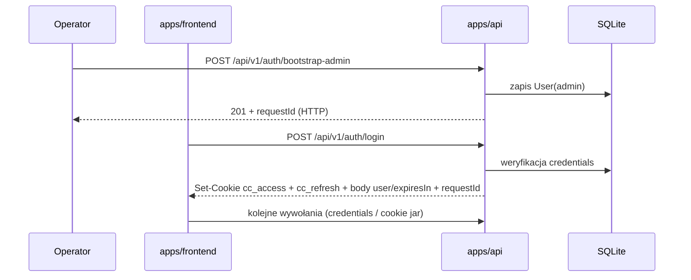
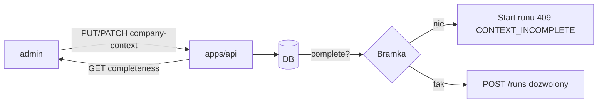
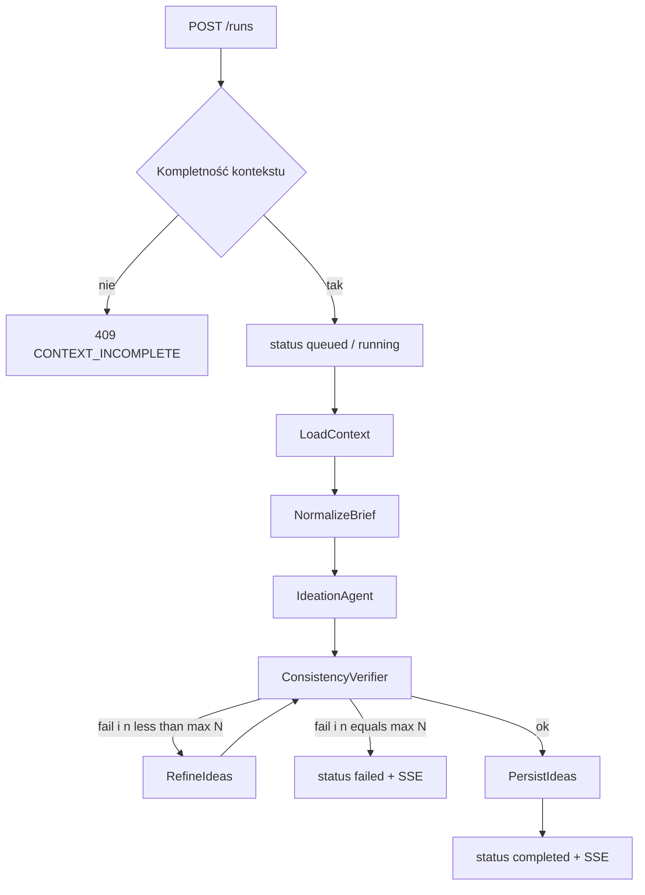
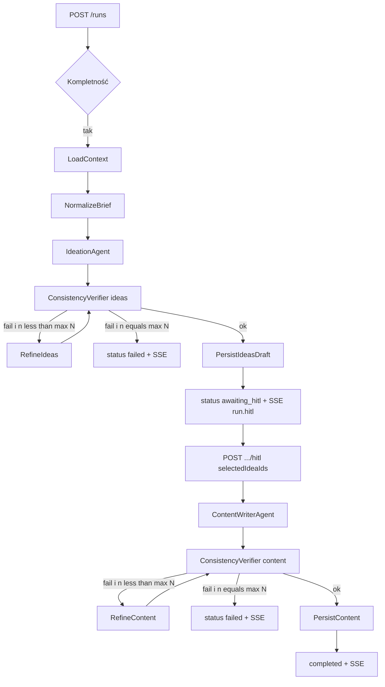
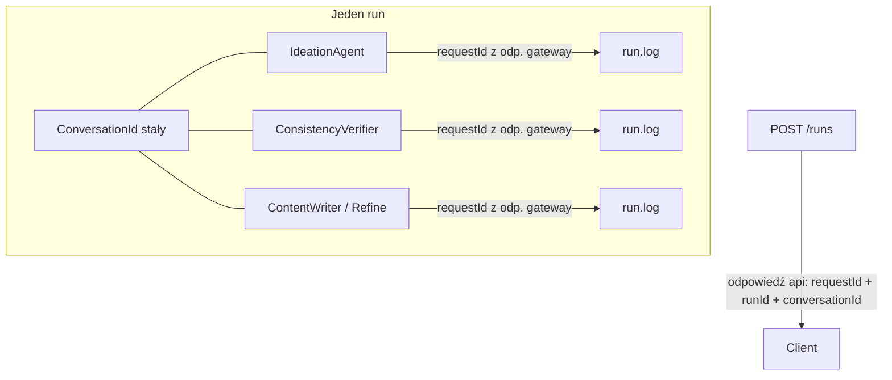
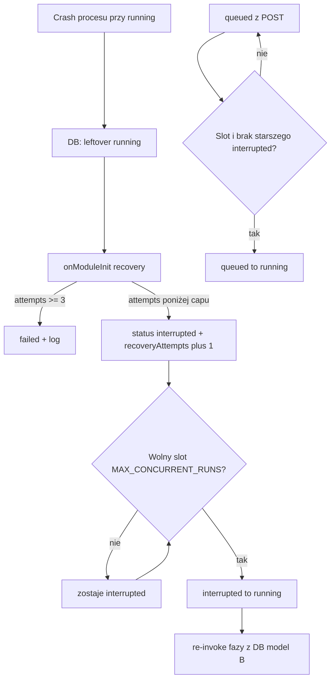

# Przepływy danych — Content Chain

Opis orkiestracji i ruchu danych w MVP. Kontrakty HTTP/SSE: `dokumentacja_komunikacji.md`. Identyfikatory: `brand_types.md`, `dictionary.md`.

## Zasady wspólne

- **DB kanoniczna** (Prisma/SQLite): kontekst firmy, użytkownicy, runy, wyniki, logi runu, **opinie tekstowe**, metadane oceny/edycji runu.
- **LLM wyłącznie** przez `apps/ai-provider-gateway`.
- **Korelacja runu agentowego:** jeden `RunId` + jeden `ConversationId`; `RequestId` HTTP z odpowiedzi `apps/api`; `RequestId` hopu LLM z odpowiedzi gateway (zapisywany w `run.log`).
- **Live UI:** SSE; snapshot logów i health/metrics — GET (patrz komunikacja).
- **Verifier:** węzeł `ConsistencyVerifier` — obowiązkowy; checklista: (1) kontekst firmy, (2) język (gramatyka, interpunkcja, składnia). Fail → Refine* z **`max N=2`**, potem z powrotem do **tego samego** `ConsistencyVerifier` (ocena poprawionego materiału). Nie wraca do `IdeationAgent` / `ContentWriterAgent`.

---

## 1. Bootstrap / auth



Dane: hasła tylko po stronie api (hash w DB); sekrety LLM nigdy we frontendzie.

---

## 2. Kontekst firmy i bramka



Sekcje bramki: tożsamość, oferta, głos SM, CTA/kanały, odbiorca (`dokumentacja_koncepcyjna.md`).  
`user` tylko czyta / korzysta; edycja wyłącznie `admin`.

---

## 3. Run jednoetapowy — `post_ideas` (full-auto)

Wejście: brief + platforma + język. Brak HITL.



| Węzeł | Dane in | Dane out | LLM |
|-------|---------|----------|-----|
| `LoadContext` | — | kontekst z DB | nie |
| `NormalizeBrief` | brief HTTP | brief znormalizowany | nie / lekko |
| `IdeationAgent` | kontekst + brief | lista pomysłów | tak → gateway |
| `ConsistencyVerifier` | pomysły + kontekst | ok / lista poprawek (kontekst **i** język) | tak → gateway |
| `RefineIdeas` | pomysły + feedback | poprawione pomysły | tak → gateway |
| `PersistIdeas` | pomysły OK | rekord wyniku + logi | nie |

Każdy hop LLM: body `conversationId` = run; po odpowiedzi gateway → wpis `run.log` z `requestId` gateway.

Analogicznie **`post_content` (full-auto):** zamiast `IdeationAgent` / `RefineIdeas` → `ContentWriterAgent` / `RefineContent`; pętla refine tak samo wraca do `ConsistencyVerifier`. Wejście zawiera wybrane / podane idea(e).

Zmiana względem: wcześniejszy mermaid `Ref --> Idea` (oraz analogicznie powrót `RefineContent` do `ContentWriterAgent`). Powód: węzły generatora piszą nowy output z briefu i nadpisywałyby wynik Refine*; verifier ma ocenić poprawiony materiał.

---

## 4. Run dwuetapowy — `post_ideas_then_content` (HITL)



Zmiana względem: wcześniejszy mermaid skracał pętlę do `VerI -->|fail refine max 2| Idea` oraz `VerC -->|fail refine max 2| Write` (powrót do generatora, bez węzła Refine*). Teraz jak §3 i graf: Refine* → ten sam ConsistencyVerifier.

HITL nie woła LLM; nowe `RequestId` pojawia się w odpowiedzi HTTP `.../hitl`. Po resume kolejne hopy LLM nadal z tym samym `ConversationId`.

---

## 5. Korelacja ID (run agentowy)



| ID | Źródło | Rola |
|----|--------|------|
| `RunId` | `apps/api` przy starcie | cały run |
| `ConversationId` | `apps/api` przy starcie | oś wszystkich hopów LLM |
| `RequestId` (HTTP) | odpowiedź `apps/api` | debug pojedynczego HTTP |
| `RequestId` (LLM) | odpowiedź gateway | kotwica logów LLM per agent |

Szczegóły: `brand_types.md`.

---

## 6. Recovery po restarcie api

Crash / restart procesu zostawia rekord w DB (status `running`); semafor `inFlight` ginie z pamięcią. Use-case recovery na bootcie **zanim** worker claimuje `queued`:



| Reguła | Norma |
|--------|--------|
| Źródło `interrupted` | wyłącznie leftover `running` na bootcie; nigdy `POST /runs` ani HITL |
| Leftover już `interrupted` | bez `recoveryAttempts++`; wraca do pompy |
| Drain | najpierw `interrupted`, potem FIFO `queued` |
| Cap | ten sam `MAX_CONCURRENT_RUNS` co przy `queued → running` |
| `awaiting_hitl` | bez zmian; nie zużywa puli recovery |

Szczegóły: `dictionary.md` (hasła `interrupted`, Recovery runu), `SPEC-RUNY.md` R-6 / R-9.

---

## 7. Ścieżki błędu (skrót)

| Sytuacja | Przepływ danych |
|----------|-----------------|
| Kontekst niekompletny | Brak grafu; **409** `CONTEXT_INCOMPLETE`; brak `ConversationId` runu |
| Błąd / timeout gateway | Log kroku (bez `requestId` przy braku odpowiedzi); po polityce retry lub **`failed`** + SSE `run.failed` |
| Verifier fail po `max N=2` | **`failed`**; w logach czytelny powód (kontekst i/lub język) |
| HITL na runie nie w `awaiting_hitl` | **409** `HITL_REQUIRED` / `CONFLICT` |
| Crash procesu przy `running` | Boot: `interrupted` (lub `failed` przy capie); claim pod `MAX_CONCURRENT_RUNS`; SSE `run.status` |
| Ocena / Edytuj / finalize gdy nie `completed`/`failed` | **409** `RUN_NOT_REVIEWABLE` |
| Zmiana oceny lub flagi po finalize | **409** `REVIEW_LOCKED` |
| Ocena / edycja / opinia o runie obcej osoby | **403** `FORBIDDEN` |
| `GET /runs/user/:userId` z cudzym id | **403** `FORBIDDEN` |

---

## 8. Przegląd runu i opinie (po pipeline)

Po `completed` albo `failed` (także gdy autor edytował output) — **poza grafem**:

```text
status completed | failed
  → autor: gwiazdki 1–5 albo zostaw null; opcjonalnie Edytuj → outputEdited=true
  → Zamknij/zapisz przegląd → reviewFinalizedAt; dalsze zmiany oceny/flagi zablokowane
```

Opinia tekstowa (`POST /feedback`) jest niezależna od finalize runu (append; target aplikacja / agent / run). Katalog agentów = stały enum, nie węzły `LoadContext` / `Persist*` / `Refine*`.

Nie mylić z HITL (wybór pomysłów w trakcie pipeline).

---

## ConsistencyVerifier — checklista (norma)

Jeden węzeł, dwa obszary (opcja B — bez osobnego LanguageQualityVerifier w MVP):

1. **Kontekst firmy** — nazwy / oferta / ton / CTA / brak sprzeczności z DB.  
2. **Język** — gramatyka, interpunkcja, składnia (dla `pl` / `en` runu).

Werdykt: `ok` albo konkretne poprawki dla Refine*. W logu / SSE rozróżnialne powody faila (kontekst vs język), nawet gdy to jeden hop LLM.

---

## Logi vs metryki

| Kanał | Co niesie |
|-------|-----------|
| `run.log` + SSE | Przebieg domenowy jednego runu (kroki, ID, treść diagnostyczna) |
| `GET /metrics` | Ops procesu `apps/api` (Prometheus) — nie zamiennik logów runu |

---

## Poza zakresem tego dokumentu

- Osobny węzeł `LanguageQualityVerifier`
- Rolki, Web/blog, YouTube
- Pełne szablony promptów (treść plików w `social/infrastructure/prompts/`)
- OpenTelemetry jako wymóg MVP
- Szczegóły scrapowania Prometheus / alerty → `deployment.md`, `observability.md`
- Widoki UI → `ux_dashboard.md`
